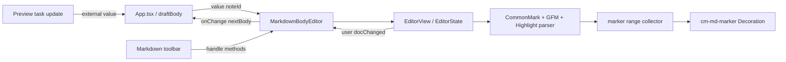

# Markdown Knowledge Board Edit Markdown記号アシスト詳細設計

作成日: 2026-08-04

状態: 実装済み（自動検証完了、Windows実機IMEの手動確認は未実施）

関連要件: [Edit Markdown記号アシスト要件定義](./edit-markdown-assist-requirements.md)

関連文書: [現行設計仕様](./design-spec.md)、[Editツールバーメニュー詳細設計](./edit-toolbar-menu-design.md)

## 1. 文書の目的

本書は、Edit画面のBodyを現行`textarea`からCodeMirror 6へ移行し、Previewで構文として成立するMarkdown記号だけを青系で表示するとともに、PCでEdit / Preview本文の文字サイズを共通調整するための実装設計を定義する。

変更は編集表示層へ限定する。`draftBody`をMarkdown文字列の正本として扱う現行state、Note型、IndexedDB、Import / Export / Backup、ReactMarkdown Preview、Marp Slidesのデータ契約は変更しない。

## 2. テスト設計

実装構成より先に、検証観点、状態依存、優先度を固定する。

### 2.1 テスト観点

| 分類 | 観点 | 検証意図 | 最優先で防ぐ不具合 |
| --- | --- | --- | --- |
| 機能 | marker range、Preview一致、toolbar、Save、Revert、Undo / Redo、Preview task、PCの`Ctrl`+wheel、共通倍率 | CodeMirror移行後も既存編集結果を維持し、表示だけを補助する | Decoration、external sync、倍率変更がdocumentを意図せず変更する |
| 非機能 | IME、長文、incremental parse、主要3ブラウザ、mobile、offline、listener / timer cleanup、連続wheel | 入力タイミング、文書長、端末差、wheel頻度で編集不能にならない | composition文字欠落、全document再走査、listenerまたはinstance二重生成 |
| データ | `draftBody`、CodeMirror doc、note ID、UTF-16 offset、history、外部更新、localStorage倍率 | ReactとEditorViewの二重正本化を防ぎ、note境界と表示設定の分離を保証する | 旧note callback、Undo、表示倍率がNote本文へ混入する |
| UI | marker class、色、font metrics、selection、caret、focus、height、scroll、80%〜180%、status、desktop / mobile差 | 現行textareaの軽い外観と操作位置を維持しつつ、疲眼時に本文を拡大できる | content誤着色、caret位置ずれ、本文領域外またはmobileの誤拡大 |

### 2.2 正常系・異常系・境界値・状態遷移

| 区分 | 対象 |
| --- | --- |
| 正常系 | marker Decoration生成、入力通知、toolbar selection復元、PC本文上の`Ctrl`+wheelで10%変更、Edit / Preview共通倍率 |
| 異常系 | parser未完了、stale callback、composition競合、不正な保存倍率、`Ctrl`なし／mobile／本文外wheel、unmount中callback |
| 境界値 | 空doc、Unicode、10万文字、visible range、table内escaped pipe、倍率80% / 100% / 180%、微小delta、上限下限超過 |
| 状態遷移 | mount→edit、doc change→React通知、note A→B、Edit→Preview→Edit、normal→expanded、composition→commit、倍率変更→tab切替→再読込 |

### 2.3 自動テスト配置

| ファイル | 対象 | 検証意図 |
| --- | --- | --- |
| `tests/unit/markdownMarkerDecorations.test.ts` | parser nodeとmarker range収集 | 有効・無効構文、code除外、table、Highlight、Unicode offsetをUIから分離して固定する |
| `tests/unit/markdownEditorSync.test.ts` | external sync判定、instance token、minimal change | 二重transaction、stale update、note境界、history方針を切り分ける |
| `tests/unit/contentFontScale.test.ts` | 倍率正規化、step、上下限、不正保存値 | browser eventから分離して80%〜180%の状態規則を固定する |
| `tests/e2e/markdown-edit-assist.spec.ts` | 色、入力、IME相当event、selection、Undo / Redo、倍率、状態遷移 | 実DOM、CodeMirror、Preview、wheel抑止のbehaviorを保証する |
| `tests/e2e/phase2-ui-ux.spec.ts` | 寸法、expanded、scroll、toolbar、mobile | 現行textarea固有assertionをCodeMirror契約へ置き換えて回帰を保証する |
| 既存E2EのBody helper | Body入力・値取得 | DOM要素種別を各テストへ漏らさず、既存保存・auth・backup・restore回帰を維持する |

unit testでは入力Markdownと期待rangeをUTF-16 offsetで比較し、失敗時にnode名、range、該当substringを表示する。E2Eではdocument値、selection、scroll、computed style、active elementを取得する。

### 2.4 実行条件と証跡

- unit、lint、build、targeted E2E、full E2Eを別gateとして実行し、失敗工程を切り分ける。
- Chromium、Firefox、WebKitを同じbrowser instanceへ並列操作しない。実機IME確認も同一実機へ並列実行しない。
- mobileは390×844、desktopは900×800、1200×800、1440×900、expanded editorは390pxと1440pxで確認する。
- 長文性能は基準fixture、文字数、marker数、browser version、OS、CPU、測定回数、95 percentileを記録する。
- flake調査では固定sleepを増やす前に、composition、transaction、React render、`requestMeasure`、animation frameの順序を記録する。

### 2.5 優先度

| 優先度 | 判定 |
| --- | --- |
| 致命 | 本文破壊、別note混入、保存値不一致、Undoで別note復元 |
| 重大 | IME不能、toolbar / Save / Revert不能、selection / scroll消失、content誤着色、mobile編集不能 |
| 軽微 | marker色、余白、境界線など、入力・保存・可読性に影響しない表示差 |

## 3. 現行構成と変更範囲

### 3.1 現行構成

- `src/App.tsx`が`draftBody`、`HTMLTextAreaElement`の`bodyRef`、selection snapshot、scroll、dirty化、toolbar handlerを保持する。
- Bodyはcontrolled `textarea`として`draftBody`を`value`へ渡し、`onChange`で`setDraftBody`と`markDirty`を実行する。
- `captureEditorSelection`は`selectionStart`、`selectionEnd`、`scrollTop`、`scrollLeft`を保存する。
- `applyEdit`は全文文字列を更新し、次animation frameでfocus、selection、scrollを復元する。
- `src/lib/markdownEdit.ts`はMarkdown文字列とUTF-16 offsetを受ける純粋関数としてtoolbar編集結果を返す。
- Previewは`remarkGfm`と単一行Highlight拡張を使用し、GFM Table、task、strikethrough、fenced code、`==highlight==`を解釈する。
- E2EはBodyをaccessible name `Body`で特定できる一方、多数のassertionが`textarea.value`、`selectionStart`、`selectionEnd`へ依存する。

### 3.2 変更ファイル

```text
src/
  App.tsx
  App.css
  components/
    MarkdownBodyEditor.tsx          CodeMirror lifecycleと外部interface
  lib/
    markdownMarkerDecorations.ts    marker range収集とDecoration
    markdownHighlightExtension.ts   単一行==highlight== parser extension
    markdownEditorSync.ts           minimal changeとoffset境界
    contentFontScale.ts             共通倍率の正規化、step、localStorage境界
tests/
  unit/
    markdownMarkerDecorations.test.ts
    markdownEditorSync.test.ts
    contentFontScale.test.ts
  e2e/
    body-editor.ts                  Body操作共通helper
    markdown-edit-assist.spec.ts
    phase2-ui-ux.spec.ts            textarea固有assertion更新
docs/
  design-spec.md
  edit-markdown-assist-requirements.md
  edit-markdown-assist-design.md
package.json
package-lock.json
```

CodeMirror lifecycleとmarker判定は`App.tsx`へ直接埋め込まず、上記componentとlibへ分離した。既存E2EのうちBody値を直接検証するspecも共通helperへ移行した。

### 3.3 変更しない領域

- `Note`型、frontmatter、Marp metadata。
- IndexedDB schema、save、import、export、backup、cloud restore。
- ReactMarkdown、Mermaid、TOC、Preview note link、Marp renderer。
- Toolbarの表示構成、command名、Markdown生成結果。
- Save / New Note shortcutと未保存確認フロー。
- marker以外の構文色、補完、lint、formatting。

## 4. 採用dependencyと最小構成

### 4.1 dependency

互換versionをそろえて次のmoduleを直接dependencyへ追加した。

- `@codemirror/state`
- `@codemirror/view`
- `@codemirror/language`
- `@codemirror/lang-markdown`
- `@codemirror/commands`
- `@lezer/markdown`

直接importするpackageはtransitive dependencyへ依存せず`package.json`へ明示する。umbrella packageの`codemirror`と第三者React wrapperは導入しない。

### 4.2 有効にするextension

- Markdown language: CommonMarkをbaseとし、GFM extensionだけを追加する。
- 独自の単一行Highlight parser extension。
- marker Decorationを提供するViewPlugin。
- `EditorView.lineWrapping`。
- historyとUndo / Redo keymap。
- editorの基本操作に必要なdefault keymap。
- placeholder。
- `EditorView.updateListener`。
- application themeとcontent attributes。

### 4.3 有効にしないextension

- line numbersとgutter。
- active line、fold gutter、bracket matching。
- autocompletion、close brackets、search panel、lint panel。
- `indentWithTab`。
- default Markdown syntax color theme。
- `basicSetup`による一括導入。

CodeMirror language packageのdefault Markdown languageはGFM以外の追加構文を含み得るため、Previewと一致するCommonMark + GFM構成を明示する。Highlight以外の独自記法は追加しない。

## 5. コンポーネント構成



### 5.1 Props

```ts
type MarkdownBodyEditorProps = {
  noteId: string | null;
  value: string;
  placeholder: string;
  labelledBy: string;
  expanded: boolean;
  active: boolean;
  onChange: (value: string) => void;
  onSelectionChange?: (snapshot: EditorSelectionSnapshot) => void;
};
```

- `value`は`draftBody`を渡す。
- `noteId`はhistoryとstale callbackを分離するstate境界とする。未保存draftは固定のdraft identityを使用し、単純な`null`共有で別draftを混同しない。
- `active`はEdit表示状態を示し、falseでも選択noteのEditorViewを維持してPreview taskなどの同一note更新を受け取れる設計を基本とする。
- `expanded`または`active`の変更はdocumentを変えず、再計測だけを要求する。

### 5.2 Imperative handle

```ts
type MarkdownBodyEditorHandle = {
  focus(): void;
  getSelectionSnapshot(): EditorSelectionSnapshot | null;
  applyEdit(result: EditResult): void;
  requestMeasure(): void;
};
```

`App.tsx`はCodeMirrorのDOM構造やEditorView instanceへ直接依存せず、このhandleを通してtoolbar、focus、selection、再計測を行う。

### 5.3 Lifecycle

1. mount時に`noteId`と`value`からEditorStateとEditorViewを1回生成する。
2. user transactionでdocumentが変わった場合だけ`onChange`を呼ぶ。
3. prop `value`変更時は現在docと比較し、差があるexternal syncだけをdispatchする。
4. `noteId`またはdraft identity変更時は旧Viewを破棄し、新しいEditorStateを作成してhistoryを分離する。
5. unmount時に`view.destroy()`を必ず実行する。
6. React Strict Modeのmount→cleanup→mountでもlistenerとViewPluginが1組だけ残ることを確認する。

## 6. Markdown parser設計

### 6.1 Previewとの対応

| Edit parser | Preview | 方針 |
| --- | --- | --- |
| CommonMark | `react-markdown` / `remark-parse` | 基本構文を一致させる |
| GFM Table / Task / Strikethrough / Autolink | `remark-gfm` | GFM extensionを明示する |
| 単一行Highlight | `remark-mark-highlight` + `remarkSingleLineHighlight` | 同じ成立条件のLezer extensionを追加する |
| fenced code info | Mermaidまたはcode renderer | fenceだけをmarker、infoとcodeをcontentとする |
| Marp固有構文 | `@marp-team/marp-core` | Preview基準の本機能では初期対象外とする |

### 6.2 Highlight extension

`markdownHighlightExtension.ts`は次のnodeを定義する。

```text
Highlight
  HighlightMark  opening ==
  content
  HighlightMark  closing ==
```

成立条件:

- openingとclosingが同一行にある。
- delimiter内が空白だけではない。
- escapeされた`\==`をopening / closingにしない。
- inline code、fenced code、code info内ではparseしない。
- 既存Previewの単一行Highlight fixtureと同じ入力に対して同じ成立・非成立結果になる。

未閉鎖または複数行の`==`は通常contentとして残し、`HighlightMark`を生成しない。

## 7. marker range収集

### 7.1 方針

`markdownMarkerDecorations.ts`はsyntax treeを走査してmarker rangeを収集し、`Decoration.mark({ class: "cm-md-marker" })`を付与する。Decorationは文字色だけを変え、widget、replace、line decorationを使用しない。

文字の見た目だけを変えるため、Decorationによってdocument、selection mapping、line height、layoutを変更しない。

### 7.2 node mapping

| Node | Decoration範囲 |
| --- | --- |
| `HeaderMark` | `#`列またはSetext underline marker |
| `QuoteMark` | `>` |
| `ListMark` | unorderedまたはordered marker全体 |
| `EmphasisMark` | opening / closingの`*`または`_` |
| `StrikethroughMark` | opening / closingの`~~` |
| `CodeMark` | inline delimiterまたはfence marker。`CodeInfo`と`CodeText`は除外する |
| `LinkMark` | link / image / autolinkの囲み記号。`URL`、`LinkLabel`、`LinkTitle`は除外する |
| `TaskMarker` | `[ ]`、`[x]`、`[X]` |
| `TableDelimiter` | delimiter行の非空白marker |
| `HorizontalRule` | ruleの非空白marker |
| `Escape` | node先頭の`\`だけ |
| `HardBreak` | backslash形式の場合の`\`だけ。trailing spaceは装飾しない |
| `HighlightMark` | opening / closingの`==` |

実装時は使用versionの実syntax treeをfixtureで確認し、node名が異なる場合はこの表とunit testを同時に更新する。tag単位のHighlightStyleだけに依存するとcontentまで同じtagを持つ構文があるため、明示node rangeを契約とする。

### 7.3 GFM Table pipe

Table header / rowのcell境界pipeが独立marker nodeにならない場合は、次の制約付きscannerを使用する。

1. syntax treeで`Table`、`TableHeader`、`TableRow`と判定済みのrangeだけを走査する。
2. `TableCell`外またはcell境界にある非escape pipeだけをmarkerとする。
3. escaped pipe、inline code内pipe、通常paragraph内pipeを除外する。
4. delimiter行は`TableDelimiter`の非空白文字をmarkerとする。

document全体を正規表現だけで走査しない。

### 7.4 incremental更新

ViewPluginは次の場合にDecorationを再構築する。

- `update.docChanged`。
- `update.viewportChanged`。
- start stateとcurrent stateでsyntax tree identityが変わった場合。
- Highlight parser stateが更新された場合。

走査対象は`view.visibleRanges`を基本とし、range境界をまたぐ構文判定に必要なlineまたはsyntax ancestorだけを拡張する。10万文字docを毎keystroke全走査しない。非表示rangeはscrollで表示rangeへ入った時点で装飾する。

## 8. React state同期

### 8.1 user transaction

```text
keyboard / paste / toolbar
  → EditorView.dispatch
  → updateListener(docChanged)
  → nextBody = state.doc.toString()
  → onChange(nextBody)
  → App.setDraftBody(nextBody) + markDirty()
```

- `docChanged === false`のselection、scroll、Decoration更新では`onChange`を呼ばない。
- user transactionごとに`onChange`と`markDirty`を1回だけ実行する。
- Reactが同じ`value`を返したときはeditorへdispatchしない。

### 8.2 external sync

external sync source:

- 保存済みnote選択。
- New Noteまたは削除Undoによるdraft初期化。
- Revert。
- Preview task checkbox。
- import / restore後に選択noteを再読込する処理。

処理規則:

1. `value === view.state.doc.toString()`なら何もしない。
2. 同一noteの変更は最小changeをdispatchし、external annotationを付ける。
3. external annotation transactionを`onChange`からReactへ返送しない。
4. note identity変更とRevertはEditorStateを再構成しhistoryをclearする。
5. Saveはdocumentを変更しないためhistoryを維持する。
6. Preview taskは利用者操作として同一noteのhistoryへ1 transactionで追加する。

### 8.3 composition

- updateListenerはCodeMirrorが確定したtransactionを通常どおり受け取る。
- composition中にReact renderされた同一documentをeditorへ書き戻さない。
- composition中の同一note external syncはpendingとして保持し、composition終了後にcurrent docと再比較する。
- note identity変更時は旧instance tokenを無効化して新EditorStateを作成し、旧composition callbackを無視する。
- IME確定直後とexternal syncが競合した場合、note identityとoperation順をログへ残し、stale callbackを採用しない。

## 9. selection、toolbar、scroll

### 9.1 Selection snapshot

```ts
type EditorSelectionSnapshot = {
  noteId: string | null;
  bodyValue: string;
  start: number;
  end: number;
  scrollTop: number;
  scrollLeft: number;
};
```

既存型を維持し、値の取得元だけを`textarea`から次へ変更する。

- `start = view.state.selection.main.from`
- `end = view.state.selection.main.to`
- scrollは`.cm-scroller`から取得する。
- `bodyValue = view.state.doc.toString()`。

初期対応は既存契約に合わせてmain selectionだけをtoolbar対象とする。CodeMirrorのmultiple selectionは有効化しない。

### 9.2 toolbar実行

1. menuを開く前にhandleからsnapshotを取得する。
2. menu自体の開閉状態はsnapshotの有無や同期タイミングから独立させる。初期化・note切替直後にsnapshotが未同期でもmenuを表示し、selection依存項目だけをdisabledにする。
3. note ID、body value、range上限でstale判定する。
4. 既存`markdownEdit.ts`の純粋関数へvalue、start、endを渡す。
5. `EditResult`の旧valueとnext valueから共通prefix / suffixを求め、単一の最小changeへ変換する。
6. UTF-16 surrogate pair境界を分断しないことをunit testする。
7. change、next selection、scroll snapshotを1 dispatchへまとめる。
8. dispatch後にeditorへfocusを戻す。

全文replaceは長文parseとUndo payloadを増やすため通常toolbar経路では使用しない。将来`EditResult`へ明示changeを追加した場合も、既存の`value`、`selectionStart`、`selectionEnd`契約を同時に維持する。

### 9.3 scrollと再計測

- toolbar transactionでは`view.scrollSnapshot()`相当のeffectまたはscroller座標を保持し、不必要なscrollIntoViewを要求しない。
- Edit→Preview時にedit scroll位置を保存し、Preview→Edit後に復元する現行契約を維持する。
- `active`がfalse→true、`expanded`が変化、View Transition完了、viewport resize時に`view.requestMeasure()`を呼ぶ。
- 非表示中の`.cm-scroller`寸法を最終値として保存しない。
- selection復元と再計測の順序は、document dispatch→表示→requestMeasure→必要なscroll復元とし、固定timeoutへ依存しない。

## 10. Undo / Redo設計

- `history()`と`historyKeymap`を有効にする。
- 通常入力、paste、toolbar、Preview taskの利用者操作をUndo単位として記録する。
- marker Decoration、selectionだけの変更、measure、React echoはhistoryへ入れない。
- note identity変更、新規draft、Revertは新しいhistory stateを作る。
- Saveはhistoryをclearしない。Save後にUndoで本文が変わった場合は通常の未保存変更として扱う。
- `Ctrl+Z` / `Command+Z`、`Ctrl+Shift+Z` / `Command+Shift+Z`およびWindows向けRedo keyを現行browser期待と比較する。
- global `Ctrl+S` / `Command+S`はCodeMirror keymapで横取りせず、現行window handlerへ到達させる。
- `Tab`用indent keymapを追加せず、editor外へのkeyboard focus移動を維持する。

## 11. CSS・レスポンシブ設計

### 11.1 Theme

```ts
const bodyEditorTheme = EditorView.theme({
  "&": { height: "100%" },
  ".cm-scroller": { overflow: "auto" },
  ".cm-content": {
    fontFamily: "inherit",
    fontSize: "inherit",
    lineHeight: "1.6",
  },
});
```

上記は概念例であり、padding、border、radius、focusは`App.css`の既存tokenへ寄せる。CodeMirrorの生成classへ広範なglobal selectorを当てず、Body editor wrapper配下へscopeする。

### 11.2 Class

| Class / token | 用途 |
| --- | --- |
| `.markdown-body-editor` | 現行`.textarea-fill`相当のlayout wrapper |
| `.markdown-body-editor .cm-editor` | border、radius、height、focus状態 |
| `.markdown-body-editor .cm-scroller` | editor内部scroll owner |
| `.markdown-body-editor .cm-content` | padding、font、line-height、caret領域 |
| `.cm-md-marker` | marker文字色だけを指定 |
| `--md-marker-color` | marker色の共通token。初期候補`#2563eb` |
| `--content-font-scale` | PCのEdit / Preview共通倍率。`1`〜`1.8`を0.1単位で使用し、下限のみ`0.8` |
| `.content-font-scale-indicator` | 倍率変更時だけ表示するfocusを持たないstatus |

### 11.3 寸法

- desktopではeditor bodyの残り高を満たし、`.cm-editor`と`.cm-scroller`を`height: 100%`、`min-height: 0`で構成する。
- mobileでは現行`.textarea-fill`の`height: min(58dvh, 520px)`、`min-height: 320px`相当をwrapperへ適用する。
- expanded時はworkspace内を満たし、Body headerを除く残り領域だけをscrollerとする。
- `cm-content`の左右paddingと先頭行位置を現行textareaの`10px 12px`へ合わせる。
- line wrappingには`EditorView.lineWrapping`を使用し、手動の不完全な`white-space`指定へ置き換えない。

### 11.4 Marker色

```css
:root {
  --md-marker-color: #2563eb;
}

.cm-md-marker {
  color: var(--md-marker-color);
}
```

font size、weight、style、background、opacityは指定しない。selectionおよびforced colorsではbrowser / system色を優先できるselectorを追加する。

### 11.5 PC用フォント倍率

- `App`は整数percentの`contentFontScale`を唯一のstateとして保持し、初期値をversion付きlocalStorage keyから復元する。読込不能または不明な値は100%とする。
- PC判定は`(min-width: 901px) and (pointer: fine)`とし、mobileでは保存済み倍率をCSSへ適用しない。
- `.markdown-body-editor`は基準`0.95rem`、`.mdPreview`は基準`1rem`へ`--content-font-scale`を乗算する。Preview見出しの比率は`em`で保持する。
- Editのeditor rootとPreviewのscroll rootへだけnative `wheel` listenerを`passive: false`で登録する。`Ctrl`が押され、PC判定を満たす場合だけ`preventDefault()`し、上方向を+10%、下方向を-10%とする。
- listenerを持たない対象本文外の`Ctrl`+wheel、`Ctrl`なしのwheel、keyboard zoom、`Meta`+wheelはbrowser既定動作へ委ねる。
- 高解像度trackpadの微小deltaは方向別に蓄積し、60px相当を1段階とする。方向反転時は未確定の累積値を破棄し、1eventでは最大1段階だけ変更する。
- 倍率は80%〜180%へclampする。上限・下限でも対象本文上の`Ctrl`+wheelはbrowser zoomへ漏らさず、現在倍率をstatus表示する。
- 変更後は`EditorView.requestMeasure()`を要求する。document、selection、history、dirty、scroll ownerは変更しない。
- `Text size: {倍率}%`を`role="status"`、`aria-live="polite"`で約1.2秒表示し、focusを移動しない。専用reset buttonは追加しない。
- localStorage例外は編集を止めず、現在sessionのstateを使用する。倍率はNote、IndexedDB、Export、Backupへ含めない。

## 12. Accessibility設計

- `EditorView.contentAttributes`で`aria-labelledby="body-label"`、multiline textboxとして必要な属性を設定する。
- wrapperではなく実際のeditable contentを`Body`ラベルへ関連付ける。
- screen readerへmarker着色専用の追加読み上げを行わず、Markdown文字列をそのまま編集可能にする。
- markerを非表示にしないため、色覚に依存せず記号自体を読める。
- `Tab`でeditor外へ移動でき、toolbar triggerへkeyboardで到達できる。
- focus ringは既存inputと同等以上、marker色は白背景で4.5:1以上とする。
- zoom 200%、Windows high contrast、`forced-colors: active`でselection、caret、focusを確認する。
- 倍率statusはpolite live regionとして通知し、表示・消去時にfocusを移動しない。keyboardのbrowser zoom経路を残す。

## 13. 状態遷移

```text
unmounted
  → mount(note identity, value)
  → ready

ready
  → user transaction
  → notify React once
  → ready

ready
  → same-note external value
  → guarded external transaction
  → ready

ready
  → note identity change / Revert
  → destroy old state
  → mount new state with empty history
  → ready

ready
  → composition start
  → composing
  → composition commit / cancel
  → apply pending same-note sync after recheck
  → ready

ready
  → Edit hidden / expanded change
  → keep document and history
  → request measure on visible geometry
  → ready

ready
  → PC target Ctrl+wheel
  → prevent browser zoom
  → clamp shared scale and persist
  → request editor measure and show transient status
  → ready
```

### 13.1 不変条件

- ready時の同期完了後は`draftBody === view.state.doc.toString()`。
- Decoration更新だけでは`isDirty`を変更しない。
- 1つのBody user transactionにつき`markDirty`は最大1回。
- 旧instanceからのcallbackは新note stateを変更しない。
- active tab変更だけではdocumentとhistoryを変更しない。
- 倍率変更、復元、status表示だけではdocument、dirty、selection、note identityを変更しない。

## 14. エラー、競合、fallback

### 14.1 Parser / Decoration

- parserは利用者入力の不完全なMarkdownを例外として扱わず、認識できたnodeだけを装飾する。
- marker collectorで未知nodeを見つけても編集を停止せず、そのnodeを非着色として扱う。
- 実装bugによるViewPlugin例外はerror boundaryでtextareaへ自動切替するのではなく、テストで検出して修正する。二重editor fallbackはstate分岐とデータ競合を増やすため初期実装に含めない。

### 14.2 React / CodeMirror競合

- user transaction由来のReact echoはdocument比較で除外する。
- external transactionにはannotationを付け、updateListenerから再通知しない。
- note identityとinstance tokenの両方でstale callbackを拒否する。
- composition中external syncは同一noteだけ保留し、note切替はstate境界として旧callbackを無効化する。

### 14.3 表示タイミング

- hidden状態からの表示、Expand / Collapse、View Transition、mobile回転で寸法が変わった場合は`requestMeasure`する。
- scroll復元失敗を時間依存で再試行し続けず、active、note identity、scroller存在、最新operation tokenを確認する。
- reduced motion時も最終selection、scroll、寸法を同じにし、animation完了eventだけへ依存しない。

### 14.4 フォント倍率

- localStorageの値はparse、finite確認、10%単位への丸め、80%〜180% clampの順で正規化する。parse不能は100%へfallbackする。
- listenerは現在mount中のEdit / Preview rootだけへ登録し、tab、note、mount状態の変化時に必ず解除して再登録する。
- wheel方向が反転した場合はdelta accumulatorをresetし、古いeventの端数で逆方向へ追加stepしない。
- status timerは新しい変更ごとに再設定し、unmount時に破棄する。timer競合で古い倍率を再表示しない。

## 15. 要件トレーサビリティ

| 要件群 | 設計箇所 | 主なテスト |
| --- | --- | --- |
| MDA-UI-001〜015 | 11. CSS・レスポンシブ | marker computed style、desktop / mobile geometry、倍率、status、forced colors |
| MDA-FN-001〜019 | 6. parser、7. range収集 | marker range unit test、無効構文、code除外、table |
| MDA-FN-020〜031 | 5. component、8〜11. sync / toolbar / history / 倍率 | existing editor E2E、toolbar、shortcut、Preview task、expanded、Ctrl+wheel |
| MDA-DATA-001〜013 | 8. React state同期、11.5、13. 状態遷移 | exact value、note switch、Revert、composition、stale callback、storage fallback |
| MDA-NFR-001〜010 | 2. test、7.4、11、14 | cross-browser、performance、cleanup、wheel多重反応、offline、bundle report |
| MDA-A11Y-001〜007 | 12. Accessibility | accessible name、Tab、zoom、status、contrast、high contrast |

## 16. 実装順序

1. Body E2E helperを追加し、既存testから`textarea`固有APIを隔離する。
2. CodeMirror dependencyと`MarkdownBodyEditor`を追加し、marker着色なしで現行編集互換を実装する。
3. toolbar、selection、scroll、history、Preview task、note切替、Revertを接続する。
4. CommonMark + GFM parserとHighlight extensionを追加する。
5. marker range collectorと`cm-md-marker`を追加する。
6. unit、targeted Chromium、Firefox、WebKit、mobile、performance、IME実機の順に検証する。
7. full validation後に本書と要件文書を`実装済み`へ更新し、production bundle増分と検証結果を記録する。
8. PC用共通フォント倍率の純粋関数、native wheel listener、CSS倍率、statusを追加し、unitと主要3ブラウザE2Eで再検証する。

各段階で前段のtestを維持する。marker着色を先に有効化してからtextarea互換問題を同時に調査しない。

## 17. 外部参照

- [CodeMirror Reference Manual](https://codemirror.net/docs/ref/)
- [CodeMirror Decoration API](https://codemirror.net/docs/ref/#view.Decoration)
- [CodeMirror Markdown language API](https://codemirror.net/docs/ref/#lang-markdown.markdown)
- [CodeMirror Styling Example](https://codemirror.net/examples/styling/)

## 18. 実装結果

2026-08-04に実装した。

- 採用version: `@codemirror/state 6.7.1`、`@codemirror/view 6.43.7`、`@codemirror/language 6.12.4`、`@codemirror/lang-markdown 6.5.1`、`@codemirror/commands 6.10.4`、`@lezer/common 1.5.2`、`@lezer/markdown 1.7.2`。
- `MarkdownBodyEditor`がEditorView lifecycle、React同期、history、selection、scroll、composition中external value保留、automation bridgeを担当する。
- marker判定はCommonMark / GFMのsyntax treeと単一行Highlight extensionを使用し、Decoration生成はvisible range単位で行う。
- PC用本文倍率はEdit / Previewで共有し、`Ctrl`+mouse wheelで80%〜180%を10%刻みで変更する。version付きlocalStorageへ保存し、mobile、対象本文外、通常wheel、keyboard zoomへ介入しない。
- `lint`、production build、unit 184件を通過した。
- `markdown-edit-assist.spec.ts`はChromium、Firefox、WebKitでmarker色、本文非着色、Undo / Redo、note history分離、toolbar selectionを確認する。ChromiumではCDPによるIME compositionの変換・確定も確認する。
- PC倍率E2Eでは通常・境界・状態遷移を分離し、共通倍率、選択と本文の不変、再読込、100%復帰、本文外・通常wheel・mobileの非介入を3ブラウザで確認した。
- 既存E2EはBody値共通helperへ移行し、mobile、expanded、Edit / Preview scroll、Preview task、Save / Revert、Delete Undo、Import、auth、backup、restoreを含む全体回帰を1 workerで実行し、143件成功・2件skipだった。skipはFirefox / WebKitで対象外としたChromium CDP IME testである。
- Windows 11 / Chromeの実ブラウザ操作ではEditが100%の`15.2px`から110%の`16.72px`へ変化し、120%ではEdit `18.24px`、Preview `19.2px`、H1 `25.92px`となった。`Text size: 120%`の一時表示、markerの青、console error 0件を確認した。
- 10万文字、marker多数、20回入力のWindows 11 / Chromium 149測定はp95 `36.2ms`、最大`45.7ms`で、50ms基準を満たした。CPUはIntel Core Ultra 7 155U、表示中marker elementは369、初期fillは3066msだった。
- production main bundleは基準commit `20eb796`の`544,985 bytes`（gzip `165,677 bytes`）から`1,050,308 bytes`（gzip `342,875 bytes`）となり、増分は`505,323 bytes`（gzip `177,198 bytes`）。`basicSetup`は使用せず必要moduleだけをimportした。
- Windows実機の日本語IME候補UIを使う手動確認は未実施。CDP compositionで文字の重複・欠落がないことまでは自動確認済みとし、リリース前の端末確認項目として残す。
