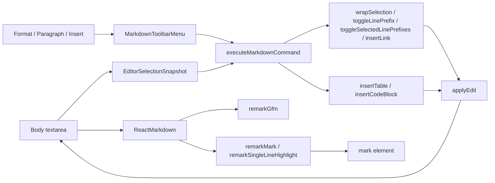

# Markdown Knowledge Board Editツールバーメニュー詳細設計

作成日: 2026-07-31

状態: 実装済み（2026-07-31）

関連要件: [Editツールバーメニュー要件](./edit-toolbar-menu-requirements.md)

## 1. 文書の目的

本書は、Bodyに直接並ぶMarkdown操作を`Format`、`Paragraph`、`Insert`の3メニューへ再編し、Highlight、Heading 3、Table、Code blockを追加するための実装設計を定義する。

既存の本文保存形式はMarkdown文字列のまま維持する。Note型、IndexedDB、Import / Export / Backup形式は変更しない。

## 2. テスト設計

実装詳細より先に、検証観点と優先度を固定する。

### 2.1 テスト観点

| 分類 | 観点 | 検証意図 | 最優先で防ぐ不具合 |
| --- | --- | --- | --- |
| 機能 | 3メニュー、既存10コマンド、新規4コマンド、複数行リスト、開閉、排他制御、フォーカス復元 | 直接ボタンからメニューへ移しても操作結果を維持し、選択行を一括変換できる | 保持した選択範囲とは異なる本文を変更する |
| 非機能 | keyboard、支援技術、mobile、長文、イベント順序、cleanup | 入力手段、端末幅、処理タイミングが変わっても操作可能にする | メニューが操作不能になる、listenerが重複する、viewport外へ出る |
| データ | Markdown、選択範囲、キャレット、scroll、dirty、Undo、block境界 | ツールバー操作対象以外の本文と保存状態を維持する | Table／Code block挿入で既存文字列を消す、後続本文をblockへ取り込む |
| UI | trigger、popover、項目、focus ring、sticky header、expanded editor | 3分類と現在の操作位置を視覚的に識別可能にする | mobileで横スクロールする、popoverがtextareaの背面へ隠れる |

### 2.2 正常系・異常系・境界値・状態遷移

| 区分 | 対象 |
| --- | --- |
| 正常系 | 3メニューを開く、14コマンドを実行する、複数行をリスト化・解除する、Previewへ反映する、Bodyへフォーカスを戻す |
| 異常系 | Escape、外側pointer、Tab離脱、note／tab切替、stale snapshot、閉じていないHighlight delimiter |
| 境界値 | 空本文、選択なし、1文字、部分行、選択末尾が次行先頭、空行を含む複数行、既存prefix混在、日本語・絵文字、連続backtick、コード内の`==`、320px幅、長文 |
| 状態遷移 | closed→open、menu A→menu B、open→execute、open→Escape、open→outside、Edit→Preview、normal→expanded |

### 2.3 自動テスト配置方針

| 追加候補 | 対象 | テストの意図 |
| --- | --- | --- |
| `tests/e2e/markdown-edit-helpers.spec.ts` | Table／Code block／複数行リストの純粋関数 | block境界、対象行、選択範囲、フェンス長をbrowser UIから独立して切り分ける |
| `tests/e2e/edit-toolbar-menu.spec.ts` | menu、keyboard、focus、既存／新規コマンド | 利用者導線と状態遷移を実ブラウザで保証する |
| `tests/e2e/markdown-highlight-preview.spec.ts` | Highlight構文とPreview | 通常テキストだけを`mark`へ変換し、codeを誤変換しないことを保証する |

`@playwright/test`はTypeScriptを読み込めるため、helperのテストにも既存runnerを使用し、新しいunit test dependencyは追加しない。

今回の実装では既存の`tests/e2e/phase2-ui-ux.spec.ts`を3メニューの表示・レスポンシブ回帰へ更新し、追加コマンド、Highlight境界値、keyboard状態遷移はPlaywright CLIの独立sessionで確認した。上表は今後、ケース単位の自動回帰を拡充するときの分割方針とする。

### 2.4 実行条件と証跡

- 同一browser pageへ複数testを並列操作しない。各testは独立したcontextで初期化する。
- mobileは320×720と390×844、desktopは900×800と1440×900、expanded editorは390pxと1440pxで確認する。
- 失敗時は本文、`selectionStart`、`selectionEnd`、`activeElement`、`aria-expanded`、開いているmenu ID、各要素のbounding boxを取得する。
- UI testは対象noteをtest内で作成し、前testのIndexedDBやlocalStorageへ依存しない。
- `npm run lint`、`npm run build`、対象Playwrightを別々のgateとして実行する。

### 2.5 優先度

| 優先度 | 判定 |
| --- | --- |
| 致命 | 本文破壊、選択範囲外の変更、Undo不能 |
| 重大 | コマンド欠落、keyboard操作不能、Preview誤変換、mobile操作不能 |
| 軽微 | 余白、色、icon位置など操作結果に影響しない表示差 |

## 3. 変更前構成と変更範囲

### 3.1 変更前構成

- `src/App.tsx`が10個の直接ボタン、編集handler、Body textarea、Previewの`ReactMarkdown`を保持する。
- `src/lib/markdownEdit.ts`が`wrapSelection`、`toggleLinePrefix`、`insertLink`を提供する。
- `applyEdit`が本文更新、dirty化、次frameでのfocus／selection／scroll復元を行う。
- Previewは`remarkGfm`を使用し、GFM Tableとfenced code blockを既に表示できる。
- `src/App.css`に30px editor control、table、inline code、code blockのstyleがある。

### 3.2 変更ファイル

```text
src/
  App.tsx
  App.css
  components/
    MarkdownToolbarMenu.tsx        新規
  lib/
    markdownEdit.ts                Table／Code block／複数行list helper追加
    remarkSingleLineHighlight.ts   複数行Highlightの通常text復元
tests/e2e/
  phase2-ui-ux.spec.ts             toolbar回帰を3menuへ更新
docs/
  design-spec.md                    全体設計を同期
  edit-toolbar-menu-requirements.md 要件
  edit-toolbar-menu-design.md       本書
package.json                        remark-mark-highlight追加
package-lock.json                   dependency lock更新
```

### 3.3 変更しない領域

- Note型とMarp metadata。
- IndexedDB schemaと保存処理。
- Markdown Import / Export / Backupの文字列形式。
- Previewのlink、task、Mermaid処理。
- Save、New Note、Expand / Collapseのshortcut。

Slidesは`@marp-team/marp-core`の別rendererであり、本要件のHighlight Preview変換対象には含めない。Table、Code block、H3はMarpが解釈可能な標準Markdownを生成する。Slidesでも`==text==`のHighlight表示が必要になった場合は、Marp用inline pluginとtheme CSSを別要件で追加する。

## 4. 構成



`MarkdownToolbarMenu`は表示とkeyboard操作を担当し、Markdown変換は行わない。`App.tsx`がcommand IDと編集handlerを接続し、文字列変換は`markdownEdit.ts`へ集約する。

## 5. 型と状態

### 5.1 ID

```ts
type MarkdownMenuId = "format" | "paragraph" | "insert";

type MarkdownCommandId =
  | "bold"
  | "italic"
  | "strikethrough"
  | "inline-code"
  | "highlight"
  | "heading-1"
  | "heading-2"
  | "heading-3"
  | "bulleted-list"
  | "task-list"
  | "blockquote"
  | "link"
  | "table"
  | "code-block";
```

### 5.2 Command定義

```ts
type MarkdownCommandDefinition = {
  id: MarkdownCommandId;
  group: MarkdownMenuId;
  label: string;
  icon: ComponentType<{ "aria-hidden"?: boolean }>;
  requiresSelection?: boolean;
  singleLineSelection?: boolean;
};
```

表示順はcommand配列の順序を正とし、JSXへ個別buttonを直書きしない。`requiresSelection`はBold、Italic、Strikethrough、Inline code、Highlightで`true`とし、`singleLineSelection`はHighlightだけ`true`とする。

### 5.3 React stateとref

```ts
type EditorSelectionSnapshot = {
  noteId: string | null;
  bodyValue: string;
  selectionStart: number;
  selectionEnd: number;
  scrollTop: number;
  scrollLeft: number;
};

const [openMarkdownMenu, setOpenMarkdownMenu] =
  useState<MarkdownMenuId | null>(null);
const editorSelectionRef = useRef<EditorSelectionSnapshot | null>(null);
```

- `openMarkdownMenu`を単一stateとし、2つ以上のmenuが開く状態を表現できなくする。
- snapshotに`noteId`と`bodyValue`を含め、menuを開いている間に対象noteまたは本文が変わった場合はstaleとして実行しない。
- menuを閉じるだけではsnapshotを直ちに破棄しない。command完了、note切替、Edit離脱、Body変更時に更新または破棄する。

## 6. `MarkdownToolbarMenu`設計

### 6.1 Props

```ts
type MarkdownToolbarMenuProps = {
  menuId: MarkdownMenuId;
  label: string;
  commands: MarkdownCommandDefinition[];
  isOpen: boolean;
  onBeforeOpen: () => void;
  onOpenChange: (open: boolean) => void;
  onCommand: (id: MarkdownCommandId) => void;
};
```

### 6.2 DOM

```tsx
<div className="md-toolbar-menu" data-menu={menuId}>
  <button
    className="md-menu-trigger"
    aria-haspopup="menu"
    aria-expanded={isOpen}
    aria-controls={`markdown-menu-${menuId}`}
  >
    <span>{label}</span>
    <ChevronDown aria-hidden="true" />
  </button>
  {isOpen ? (
    <div id={`markdown-menu-${menuId}`} role="menu" aria-label={`${label} menu`}>
      {/* role=menuitem buttons */}
    </div>
  ) : null}
</div>
```

閉じたmenuはDOMから除去し、Tab順序とaccessibility treeへ残さない。

### 6.3 開閉

- triggerのpointerdownまたはkeyboard open前に`onBeforeOpen`でsnapshotする。
- click、Enter、Spaceで開き、最初の有効項目へfocusする。
- 別triggerを開いた場合は`openMarkdownMenu`の置換だけで切り替える。
- 項目実行、Escape、root外pointerdown、Edit離脱、note切替で閉じる。
- Escapeはtriggerへfocusを戻す。
- 項目実行はmenuを閉じてから`onCommand`を呼び、`applyEdit`がBodyへfocusを戻す。
- Tab / Shift+Tabは`preventDefault`せずmenuだけ閉じ、browser標準のfocus移動を維持する。

### 6.4 項目keyboard操作

- item button配列をrefで保持する。
- ArrowDown / ArrowUpは有効項目だけを循環する。
- Home / Endは最初／最後の有効項目へ移動する。
- Enter / Spaceは現在項目を実行する。
- `requiresSelection`のcommandはsnapshotのselectionが空の場合に`disabled`とする。
- `singleLineSelection`のcommandはselectionに`\r`または`\n`がある場合も`disabled`とする。既存のBold、Italic、Strikethrough、Inline codeは複数行選択を許可する。
- disabled itemはarrow移動対象から除外する。

## 7. 選択範囲と実行フロー

### 7.1 Snapshot取得

`captureEditorSelection`は`bodyRef.current`からselectionとscrollを取得し、その時点の`selectedId`と`draftBody`を保存する。Bodyの`onSelect`でも同じrefを更新し、keyboardでtriggerへ移動した場合に最後の選択を利用できるようにする。

### 7.2 Stale判定

command実行時に次のいずれかを満たす場合は編集しない。

- snapshotがない。
- snapshotの`noteId`と現在の`selectedId`が異なる。
- snapshotの`bodyValue`と現在の`draftBody`が異なる。
- selectionが現在の本文長を超える。

stale時はmenuを閉じ、現在のBodyへfocusを戻す。本文とdirty状態は変更しない。

### 7.3 `applyEdit`

`applyEdit`へsnapshotのscroll値を渡せるようにし、menuへfocusが移った後のtextarea値ではなく、操作前のscroll位置を復元する。

```ts
function applyEdit(result: EditResult, snapshot: EditorSelectionSnapshot): void;
```

本文更新と`markDirty`は1回だけ行い、次のanimation frameでfocus、selection、scrollTop、scrollLeftを復元する。

## 8. Command設計

### 8.1 既存command

| ID | 処理 |
| --- | --- |
| `bold` | `wrapSelection(value, start, end, "**", "**", "bold")` |
| `italic` | `wrapSelection(value, start, end, "*", "*", "italic")` |
| `strikethrough` | `wrapSelection(value, start, end, "~~", "~~", "strike")` |
| `inline-code` | 1個のbacktickをprefix／suffixにした`wrapSelection` |
| `heading-1` | `toggleLinePrefix(value, start, "# ")` |
| `heading-2` | `toggleLinePrefix(value, start, "## ")` |
| `bulleted-list` | `toggleSelectedLinePrefixes(value, start, end, "- ")` |
| `task-list` | `toggleSelectedLinePrefixes(value, start, end, "- [ ] ")` |
| `blockquote` | `toggleLinePrefix(value, start, "> ")` |
| `link` | `insertLink(value, start, end)` |

#### 複数行リスト

`toggleSelectedLinePrefixes`はselectionが空なら既存の`toggleLinePrefix`へ委譲する。selectionがある場合は、先頭・末尾が行途中でも選択が触れる行全体を対象とし、選択末尾が次行の先頭にある場合はその次行を含めない。

- 空行は変更しない。
- 対象の非空行がすべて指定prefixを持つ場合は、全対象行からprefixを外す。
- 混在状態では、prefixがない非空行だけへ付与する。
- 行頭のindentationは維持し、その直後へprefixを付与する。
- 編集後は変換した行全体を選択し、選択外の前後本文は変更しない。

### 8.2 Highlight

編集側は`wrapSelection(value, start, end, "==", "==", "highlight")`を利用する。selectionが空、または`\r`／`\n`を含む場合は項目をdisabledにし、本文を変更しない。

### 8.3 Heading 3

`toggleLinePrefix(value, start, "### ")`を利用する。現行helperと同様、現在行だけを対象にする。PreviewのH3および既存H1〜H3 TOCへ追加処理なしで反映される。

### 8.4 共通block境界

`insertTable`と`insertCodeBlock`は次の共通規則を利用する。

1. block前に本文があり、直前が空行でなければ必要な改行を補う。
2. block後に本文があり、直後が空行でなければ必要な改行を補う。
3. 既存文字列をtrimしない。
4. 返却するselectionは挿入block内の編集開始箇所とする。

共通内部helperは`insertBlockAt(value, index, block, innerStart, innerEnd)`とし、`EditResult`を返す。

### 8.5 Table

```ts
function insertTable(value: string, start: number, end: number): EditResult;
```

- selectionが空なら`start`、selectionがある場合は選択文字列を保持して`end`へ挿入する。
- 挿入templateは次とする。

```markdown
| Header 1 | Header 2 |
| --- | --- |
| Cell 1 | Cell 2 |
```

- 返却selectionは`Header 1`だけを選択する。
- 行中で実行した場合は前後の既存文字を別paragraphとして保持する。
- indentationを継承せずcolumn 0へ挿入し、list／blockquoteを意図せず継続しない。

### 8.6 Code block

```ts
function insertCodeBlock(value: string, start: number, end: number): EditResult;
```

- selectionがある場合はその文字列をblock内容として置換位置へ戻し、文字列を失わない。
- selectionが空なら`code`を内容とする。
- 内容中の最長backtick連続数を数え、`Math.max(3, longestRun + 1)`個をfenceにする。
- 内容の先頭・末尾をtrimしない。閉じfence前に改行がない場合だけ1つ補う。
- 返却selectionは元の選択内容、または`code`だけを選択する。
- languageは空とし、開始fence末尾へ利用者が追記する。

## 9. Highlight Preview設計

### 9.1 方針

`==text==`はGFM標準ではないため、micromark拡張を提供する`remark-mark-highlight`を使用する。raw HTMLと`rehype-raw`は有効化しない。ライブラリが認識する複数行の`mark`は、後段の`remarkSingleLineHighlight`で元の`==...==`の通常textへ戻し、本要件の1行限定ルールを保証する。

```tsx
<ReactMarkdown
  remarkPlugins={[remarkGfm, remarkMark, remarkSingleLineHighlight]}
>
  {draftBody}
</ReactMarkdown>
```

### 9.2 構文拡張

`remarkMark`がmicromark syntax extensionとfrom-markdown extensionを登録し、`remarkSingleLineHighlight`が生成後のmdastを検証する。

- 開始／終了delimiterは連続する2個の`=`。
- 内容は空または空白だけにしない。
- 改行をまたがない。
- backslash escapeされたdelimiterを開始／終了として扱わない。
- inline codeとfenced code blockはmicromarkのcode tokenが優先されるため解析対象外とする。
- 閉じdelimiterがない場合は通常textのまま保持する。

生成するmdast nodeは次の論理形とする。

```ts
type MarkNode = {
  type: "mark";
  children: PhrasingContent[];
  data: { hName: "mark" };
};
```

`hName`は固定値とし、入力文字列をelement名やattributeへ使用しない。HTML parserを経由しないため、Highlight追加によって任意HTML実行面を広げない。

`remark-mark-highlight`は`package.json`の直接dependencyとして固定する。

### 9.3 Style

```css
.mdPreview mark {
  padding: 0 0.12em;
  border-radius: 2px;
  background: var(--preview-highlight-bg);
  color: inherit;
}
```

`--preview-highlight-bg`は`#fff2a8`とし、文字色は既存本文色を継承する。色だけに意味を依存する操作状態ではないため、outlineは追加しない。

### 9.4 非対象

- 複数paragraphをまたぐHighlight。
- SlidesのMarp renderer。
- Highlight内に別の`==`をnestする構文。
- source Markdown自体をHTMLへ書き換えること。

## 10. CSS／レスポンシブ設計

### 10.1 Class

| Class | 用途 |
| --- | --- |
| `.md-toolbar` | 3menuと既存Expandの配置 |
| `.md-toolbar-menu` | triggerとpopoverのanchor |
| `.md-menu-trigger` | 30px文字ラベル付きtrigger |
| `.md-menu-popover` | menu panel |
| `.md-menu-item` | iconと可視labelを持つ項目 |

### 10.2 寸法

- trigger高さは`var(--control-editor-height)`の30px。
- desktopのtrigger幅はFormat／Insertを80px、Paragraphを104pxとし、間隔は8pxで均一化する。
- triggerは左右8px padding、labelはnowrap、chevronは13px。
- popoverは`min-width: 178px`、`max-width: min(220px, calc(100vw - 24px))`。
- itemは最小32px高、iconは15px、文字は0.82rem。
- Formatは左端、Paragraphはtrigger左端、Insertは右端基準でpopoverを配置する。
- `.body-header`とmenu anchorは`overflow: visible`を維持し、popoverをsticky header内でclipしない。

### 10.3 Mobile

- `max-width: 900px`ではBody labelを1段目、menu群とExpandを2段目に置く既存gridを維持する。
- mobileのtrigger幅はFormat／Insertを66px、Paragraphを86px、間隔を4pxとする。
- 320pxで3triggerとExpandが収まらない場合はmenu群だけを折り返し、page全体を横scrollさせない。
- popoverはviewport端から12px以上内側に収める。
- expanded editorでも同じbreakpointと寸法を使う。

## 11. Accessibility設計

- toolbarは`role="toolbar"`と`aria-label="Markdown tools"`を維持する。
- triggerは`aria-haspopup="menu"`、`aria-expanded`、`aria-controls`を持つ。
- popoverは`role="menu"`、itemは`role="menuitem"`を持つ。
- iconは`aria-hidden="true"`、command名は可視textとaccessible nameを一致させる。
- disabled commandはnative `disabled`を使用し、arrow navigationでskipする。
- `:focus-visible`でtriggerとitemに3:1以上のfocus境界を表示する。
- Escape、Tab、command実行後のfocus先をE2Eで確認する。

## 12. 状態遷移

| 現在 | event | 次状態 | 副作用 |
| --- | --- | --- | --- |
| closed | trigger open | selected menu open | snapshot取得、最初のitemへfocus |
| menu A open | trigger B | menu B open | Aをunmount、Bの最初のitemへfocus |
| open | command | closed | stale確認、編集、Bodyへfocus |
| open | Escape | closed | 本文変更なし、triggerへfocus |
| open | outside pointer | closed | 本文変更なし |
| open | Tab / Shift+Tab | closed | browser標準のfocus移動 |
| open | note／tab変更 | closed | snapshot破棄、listener cleanup |

## 13. エラーと競合

- commandは同期的な文字列変換とし、network／IndexedDBへ依存しない。
- stale snapshotは例外にせずno-opとする。
- 変換helperが範囲外indexを受けた場合は既存helperと同様にclampする。
- outside pointer handlerはmenu rootの`contains`で項目clickを除外し、command前にsnapshotを破棄しない。
- global listenerはmenu open中だけ登録し、effect cleanupで必ず解除する。
- Highlight parserが不正構文を受けてもPreview全体を失敗させず、元のtextとして表示する。

## 14. 受け入れテスト対応

| 要件 | 設計箇所 | 主な自動化候補 |
| --- | --- | --- |
| 3menuと排他開閉 | 5、6、12 | `edit-toolbar-menu.spec.ts` |
| 選択範囲保持 | 5.3、7 | `edit-toolbar-menu.spec.ts` |
| 既存10command | 8.1 | `edit-toolbar-menu.spec.ts` |
| 複数行リスト | 8.1 | `markdown-edit-helpers.spec.ts`、`edit-toolbar-menu.spec.ts` |
| Highlight | 8.2、9 | `markdown-highlight-preview.spec.ts` |
| Heading 3 | 8.3 | `edit-toolbar-menu.spec.ts` |
| Table | 8.4、8.5 | `markdown-edit-helpers.spec.ts`、`edit-toolbar-menu.spec.ts` |
| Code block | 8.4、8.6 | `markdown-edit-helpers.spec.ts`、`edit-toolbar-menu.spec.ts` |
| keyboard／ARIA | 6.3、6.4、11 | `edit-toolbar-menu.spec.ts` |
| mobile／expanded | 10 | `edit-toolbar-menu.spec.ts` |

## 15. 実装結果

1. `markdownEdit.ts`へTable／Code block／複数行リストの純粋関数を追加した。
2. `remark-mark-highlight`と`remarkSingleLineHighlight.ts`をPreviewへ接続した。
3. `MarkdownToolbarMenu.tsx`へ排他開閉、keyboard、focus、ARIAを実装した。
4. `App.tsx`へcommand定義、selection snapshot、stale判定、実行dispatcherを接続した。
5. `App.css`へmenu、320px／390px responsive、Highlight styleを追加した。
6. 既存toolbar E2Eを新しいmenu導線へ更新した。
7. lint、build、対象E2EとPlaywright CLIを実行し、本文、selection、focus、Highlight境界値、複数行リストの部分選択・空行・混在・行先頭境界、320px／390px geometryを確認した。
