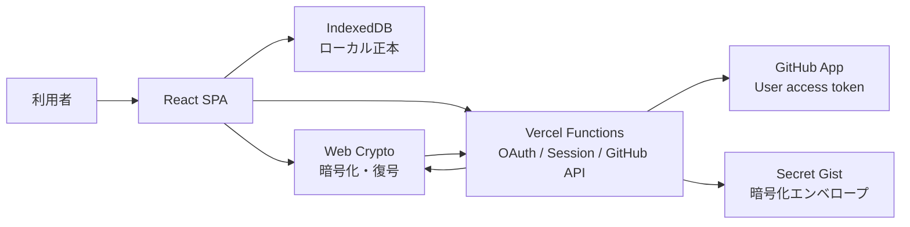

# Markdown Knowledge Board フェーズ2 認証・クラウドバックアップ基本設計

作成日: 2026-07-30
文書状態: PR8 Production readiness自動化と同期

## 1. 目的と位置づけ

本書は、[フェーズ2要件定義](./phase2-auth-cloud-backup-requirements.md)を実装可能な構成へ具体化する基本設計である。現行機能の詳細は[現行設計仕様](./design-spec.md)、HTTP 契約は[API・認証詳細設計](./phase2-auth-cloud-backup-api-design.md)、ブラウザ内の状態・暗号化・復元は[フロントエンド詳細設計](./phase2-auth-cloud-backup-frontend-design.md)、実行順序と担当は[実装計画](./phase2-auth-cloud-backup-implementation-plan.md)を参照する。

2026年8月3日時点で、PR1～PR7のローカルJSON、暗号化、Production API境界、任意GitHub認証、手動Cloud Backup、検証済みdownload、ブラウザ復号、差分preview、safe merge、単一transaction復元に加え、PR8のoffline、mobile viewport、focus、主要3ブラウザ回帰を実装済みである。Productionの`SESSION_KEYS`だけを準備し、Preview／Developmentへ秘密情報を配布していない。GitHub AppとGitHub用Production変数、実結合、実mobileのゲートが未完了のためcloud feature flagは既定offとする。

| 領域 | 現行実装 | フェーズ2での扱い |
| --- | --- | --- |
| ローカル保存 | IndexedDB version 1、`notes` store、単件get/put/delete、復元用の単一transaction | 正本として維持し、復元失敗時は全rollbackする |
| ノートデータ | `pinnedAt`、Marp設定、`customMetadata`を含む`Note` | 暗号化snapshotと競合判定で全項目を保持する |
| JSONバックアップ | `src/lib/backup.ts`のversion 1作成・parse、手動保存／インポート | PR1で共通moduleへの抽出と現行roundtrip回帰を完了。クラウド暗号化でも再利用する |
| 復元基盤 | `cloudRestore.ts`のstrict検証・fingerprint・merge plan、`useCloudRestore.ts`の復号・再検証、`db.ts`のtransaction apply | PR7でpreviewとsafe merge UIへ接続済み。local-only noteと競合を保持する |
| 認証・クラウドUI | session hook、任意ログイン、Sign out、Disconnect、明示的なCloud Backup／Restoreを実装済み。feature flagは既定off | PR8のゲート完了後だけProductionで有効化する |
| Vercel Functions／Gist／暗号化 | 4.5 MB上限、Gist検出・作成・revision付き更新、検証済みraw download、browser暗号化・復号を実装済み | Productionの実GitHub経路はPR8で直列確認する |

## 2. 設計原則

1. IndexedDB を常にローカルデータの正本とする。
2. 認証確認、GitHub API、ネットワークの失敗をローカル機能から分離する。
3. クラウドバックアップと復元は利用者の明示操作だけで開始する。
4. Markdown 平文と暗号パスフレーズはブラウザから送信しない。
5. GitHub token と client secret はブラウザ JavaScript から参照できない場所に置く。
6. 復元はプレビュー後の安全なマージとし、無警告の上書きと削除を行わない。
7. 2つの本番 Origin を独立した保存・認証領域として扱う。

## 3. テスト設計観点

詳細ケースを定義する前に、次の観点で設計と実装をレビューする。

| 分類 | 主な観点 | 検証意図 |
| --- | --- | --- |
| 機能 | 任意ログイン、手動バックアップ、手動復元、Sign out、連携解除 | 認証・クラウド機能が要求した操作だけを実行すること |
| 非機能 | 機密情報、CSRF、SSRF、可用性、タイムアウト、性能、監査 | クラウド障害や攻撃がローカルデータと秘密情報へ波及しないこと |
| データ | Origin 分離、暗号形式、Gist 識別、リビジョン、`pinnedAt`、`customMetadata`、マージ、rollback | データの取り違え、欠落、無警告上書きを防ぐこと |
| UI | application menu、ダイアログ、処理中表示、mobile、支援技術 | 状態と次の操作を誤解なく、端末差があっても利用できること |

正常系・異常系・境界値・状態遷移は次のように切り分ける。

| 区分 | 対象 |
| --- | --- |
| 正常系 | 未ログインのローカル利用、OAuth 成功、初回作成、更新、別ブラウザ復元、Sign out、連携解除 |
| 異常系 | OAuth 拒否、state 不一致、Preview/localhostからのAPI要求、401/403/404/429/5xx、timeout、offline、復号失敗、保存失敗、payload破損 |
| 境界値 | 0件、1件、100件以上、1 MB 前後、4,500,000 bytes、4,500,001 bytes、重複 ID、複数 Gist、メタデータ20/21階層・1,000/1,001要素 |
| 状態遷移 | 未保存→保存→OAuth、token refresh、upload retry、revision conflict、preview→apply→rollback |

最優先で防止する事象は、平文流出、token 流出、OAuth による未保存編集の消失、復元・更新による無警告上書き、認証障害によるローカル機能停止である。

## 4. 対象範囲と現行差分

### 4.1 維持する現行構成

- React、TypeScript、Vite の SPA
- IndexedDB `markdown-knowledge-board` / object store `notes`
- `pinnedAt`、Marp設定、`customMetadata`を含む`Note`とローカル JSON バックアップ version 1
- Markdown の作成、編集、閲覧、保存、削除、import/export
- `Backup All Notes` と `Import Backup`
- application menu と英語の利用者向け文言

### 4.2 追加する構成

- GitHub App の Web Application Flow
- Vercel Functions による OAuth、session、GitHub API 中継
- Web Crypto API によるブラウザ内暗号化・復号
- Secret Gist への暗号化スナップショット
- Gist 検出、リビジョン確認、複数候補選択
- 復元プレビュー、安全なマージ、単一 IndexedDB transaction
- 4.5 MB以下の暗号化エンベロープを直接送受信するクラウド API

### 4.3 対象外

- 常時同期、共同編集、自動バックアップ、自動復元
- GitHub を使わない独自アカウント
- Gist の自動削除、ローカル全置換、パスフレーズ復旧
- 2つの本番 Origin 間の IndexedDB・Cookie の自動共有
- Service Worker による完全オフライン新規起動

## 5. システム構成



### 5.1 コンポーネント責務

| コンポーネント | 責務 | 保持してはならない情報 |
| --- | --- | --- |
| React SPA | ローカル編集、未保存確認、操作開始、状態・結果表示 | GitHub token、client secret |
| IndexedDB | 保存済みノートの正本 | token、パスフレーズ、導出鍵 |
| Web Crypto | BackupDocument の暗号化・復号、完全性検証 | 永続化されたパスフレーズ・鍵 |
| Vercel Functions | OAuth code 交換、session、GitHub API 中継、入力検証 | Markdown 平文、パスフレーズ |
| GitHub Gist | 暗号化エンベロープのスナップショット | Markdown 平文、鍵、パスフレーズ |

### 5.2 暗号化ファイル上限と直接転送

Vercel Functions の request/response body 上限に合わせ、暗号化エンベロープは UTF-8 bytes で最大 4,500,000 bytes（4.5 MB）とする。ブラウザと Functions、Functions とブラウザの間は envelope bytes を分割せず直接送受信する。

- upload は `application/vnd.mkb.encrypted-backup+json` の raw body とし、JSON wrapper による追加サイズを発生させない。
- download も同じ media type の raw body とし、metadata は response header へ分離する。
- client は送信前、server は読み込み中と読み込み後に4,500,000 bytes上限を検証する。
- 上限超過時は Gist APIを呼ばず、ローカル JSONバックアップを案内する。
- 一時オブジェクトストレージ、分割upload、分割downloadは導入しない。
- 1 MB超のGistは GitHub APIの `raw_url` からFunctionsが全体を取得し、同じ4.5 MB上限を適用する。

## 6. データ境界と処理フロー

### 6.1 ローカル保存

```text
editor draft -> Save -> IndexedDB -> React state refresh
```

認証確認と並行して開始できる。認証状態にかかわらず同じ処理を使用する。

### 6.2 クラウドバックアップ

```text
unsaved check
  -> IndexedDB snapshot
  -> BackupDocument validation
  -> browser encryption
  -> encrypted envelope raw upload
  -> revision recheck
  -> Secret Gist create/update
  -> local cloud metadata update
```

暗号化前のデータは `fetch`、サーバーログ、一時ストアへ渡さない。Gist 成功応答を受ける前に `Last cloud backup` を更新しない。

### 6.3 クラウド復元

```text
Gist selection
  -> encrypted envelope raw download
  -> browser size/hash verification
  -> browser decryption
  -> BackupDocument validation
  -> merge preview
  -> unsaved check
  -> single IndexedDB transaction
  -> result dialog
```

復号・形式検証・プレビューが完了するまで IndexedDB を変更しない。Gist に存在しないローカルノートは削除しない。

### 6.4 Sign out と連携解除

| 操作 | session | GitHub token | アカウント別ローカル連携メタデータ | IndexedDB | Gist |
| --- | --- | --- | --- | --- | --- |
| Sign out | 破棄 | session 内の参照を破棄 | 保持 | 保持 | 保持 |
| Disconnect GitHub | 破棄 | 可能な限り GitHub 側で失効 | 破棄 | 保持 | 保持 |

Sign out はアプリ session の終了であり、GitHub App 認可の取消しではない。連携解除で失効処理が失敗してもローカル session と連携メタデータは破棄し、GitHub 設定画面での確認導線を結果に表示する。

## 7. Origin・認証 URL 設計

### 7.1 本番 Origin

| key | Application Origin | callback URL |
| --- | --- | --- |
| `primary` | `https://mkb.bamboosato.com` | `https://mkb.bamboosato.com/api/auth/github/callback` |
| `vercel` | `https://markdown-knowledge-board.vercel.app` | `https://markdown-knowledge-board.vercel.app/api/auth/github/callback` |

GitHub App は複数 callback URL を登録し、OAuth 開始時に対応する `redirect_uri` を明示する。GitHub は最大10件の callback URL をサポートするため、本番2 URLを同じ GitHub App に登録できる。

### 7.2 Origin 解決規則

- `Request.url` の Origin を静的 allowlist と照合し、対応する key と callback URL を選ぶ。
- 任意 query、未検証の `Host` / `X-Forwarded-Host`、汎用 suffix match から callback URL を構築しない。
- OAuth state に origin key と同一 Origin 内の戻り先を結び付ける。
- 現行 SPA は単一画面のため、初期実装の戻り先は `/` だけを許可する。
- allowlistには本番2 Originだけを登録する。Vercel Preview URLとlocalhostは登録せず、認証・クラウドAPIで拒否する。
- session、OAuth state、CSRF Cookie は host-only とし、`Domain` 属性を付けない。

### 7.3 Origin 間のデータ分離

IndexedDB、localStorage、Cookie は Origin ごとに独立する。Vercel URL の UI には `Local data is stored separately for this address.` を補足表示し、通常案内先として primary URL へのリンクを置く。移行手段はローカル JSON または暗号化クラウドバックアップであり、自動コピーは行わない。

### 7.4 環境ポリシー

| 環境 | ローカル機能 | GitHub認証・クラウド | callback | 秘密情報 |
| --- | --- | --- | --- | --- |
| Production primary | 有効 | 有効 | 登録する | Production scopeのみ |
| Production Vercel URL | 有効 | 有効 | 登録する | Production scopeのみ |
| Vercel Preview | 有効 | 無効 | 登録しない | 配布しない |
| localhost | 有効 | 実接続は無効、stub/mockのみ | 登録しない | 本番値を使用しない |

Vercel Preview deploymentはPhase 2の認証・クラウド機能の検証環境として使用しない。PR連携によりPreviewが自動生成されても、cloud UIを無効化し、Functionsは`VERCEL_ENV === "production"`とexact Originの両方を満たさない要求をGitHub API呼出前に拒否する。実GitHub結合確認は専用テストアカウントを用いてProductionで直列実行する。

## 8. 認証・session 方針

- GitHub App User access token の Web Application Flow を使用する。
- GitHub App 権限は user permission `Gists: write` のみとし、Repository、Organization、email 権限を要求しない。
- expiring user access token を有効化する。access token は8時間、refresh token はGitHubの現行仕様上6か月である。
- access token、refresh token、最小限のアカウント情報をサーバー鍵で封印した `HttpOnly` session Cookie に格納する。
- token を localStorage、sessionStorage、IndexedDB、React state、URLへ格納しない。
- Cookie の復号と token refresh は Functions 内だけで行う。
- Sign out は Cookie を失効し、Disconnect は GitHub の token 失効 endpoint も呼ぶ。
- 認証確認は IndexedDB 初期化を待たせず、timeout/offline 時は `unknown` または `unavailable` とする。

session Cookie の詳細と refresh 競合対策は API 詳細設計で定義する。

## 9. セキュリティ設計

### 9.1 脅威と対策

| 脅威 | 対策 |
| --- | --- |
| Secret Gist URL の漏えい | ブラウザ内 AES-GCM 暗号化、パスフレーズ非保存 |
| OAuth login CSRF | 256 bit state、host-only state Cookie、期限、一回使用、定数時間比較 |
| API CSRF | SameSite Cookie、正確な Origin 検証、double-submit CSRF token |
| open redirect | origin key と `/` だけの戻り先 allowlist |
| token 露出 | HttpOnly sealed Cookie、ログ redaction、URLに含めない |
| raw URL SSRF | HTTPS と `gist.githubusercontent.com` の完全一致、redirect 再検証 |
| Gist 無警告上書き | expected revision の直前再確認、409、明示置換確認 |
| 悪意ある巨大入力 | client/server双方の4,500,000 bytes上限、stream打切り、JSON深さ制限 |
| 復元部分反映 | 全検証後の単一 readwrite transaction、失敗時 rollback |

### 9.2 ログ方針

記録可能な値は `requestId`、処理段階、HTTP status、内部 error code、所要時間、bytes 区分、retry 回数に限定する。次の値はログ、分析、エラー監視へ送らない。

- Markdown、title、tags、暗号パスフレーズ、鍵
- access token、refresh token、client secret、Cookie 値、OAuth code/state
- 暗号文本体、一時オブジェクト URL

GitHub login、user ID、Gist ID は通常ログへ出さず、必要時も irreversible hash または末尾4文字へ縮退する。

## 10. 可用性・性能・競合

### 10.1 timeout

| 処理 | client timeout | server outbound timeout | timeout 後 |
| --- | --- | --- | --- |
| session 確認 | 5秒 | 4秒 | cloud unavailable、local 継続 |
| OAuth code 交換 | callback 全体15秒 | 10秒 | signed out、再試行案内 |
| Gist metadata | 15秒 | 10秒 | 手動再試行 |
| encrypted upload/download | 30秒 | 20秒 | remote状態確認後に手動再試行 |
| Gist create/update | 30秒 | 20秒 | 再取得して成否確認 |

timeout により spinner を残さず、通信復旧時も自動バックアップ・自動復元を行わない。

### 10.2 idempotency

- upload は client-generated `operationId` と envelope SHA-256 を送る。
- create 完了直前に候補 Gist を再検索し、重複作成を防ぐ。
- create/update timeout 後は対象 Gist を再取得し、期待した content hash が一致すれば成功として確定する。異なる場合は自動再作成・再更新しない。

### 10.3 リビジョン競合

更新直前に `GET /gists/{gist_id}` の `history[0].version` を取得し、client の expected revision と比較する。不一致なら PATCH せず 409 を返す。GitHub Gist API には設計上利用できる原子的 compare-and-swap がないため、GET と PATCH の間に残る競合窓は既知の制約とする。操作直前の再確認、短い処理区間、更新後の revision/content hash 確認でリスクを縮小し、E2E で競合を注入する。

## 11. 配置とモジュール境界

```text
api/
  _lib/
    auth.ts            OAuth と token refresh
    session.ts         sealed Cookie
    csrf.ts            Origin / CSRF 検証
    github.ts          GitHub REST client
    gist.ts            Gist 検出・revision
    response.ts        envelope / requestId / error
  auth/
    session.ts
    signout.ts
    disconnect.ts
    github/start.ts
    github/callback.ts
  cloud-backups/
    index.ts
    update.ts
    content.ts

src/
  components/cloud/...
  hooks/useGitHubSession.ts
  hooks/useCloudBackup.ts
  lib/backup.ts
  lib/cloudApi.ts
  lib/cloudCrypto.ts
  lib/cloudMetadata.ts
  lib/cloudRestore.ts
  lib/db.ts
```

現行 `App.tsx` 内の `BackupDocument`、作成、parse 処理は `src/lib/backup.ts` へ抽出し、ローカル JSON とクラウド暗号化の共通形式として再利用する。UI、暗号化、GitHub API、マージ判断を同一ファイルへ集約しない。

## 12. 構成値・秘密情報

| 名前 | 種別 | 用途 |
| --- | --- | --- |
| `GITHUB_APP_CLIENT_ID` | server env | OAuth と token 失効 |
| `GITHUB_APP_CLIENT_SECRET` | server secret | code 交換、refresh、失効 |
| `SESSION_KEYS` | server secret | active/previous key ID と 32-byte AES 鍵 |
| `GITHUB_API_VERSION` | checked-in constant | GitHub REST version header（`2026-03-10`） |
| `ORIGIN_CONFIG` | checked-in typed constant | origin key と exact URL/callback の固定対応 |
| `PBKDF2_ITERATIONS_V1` | frontend constant | envelopeVersion 1 の鍵導出回数 |
| `VERCEL_ENV` | Vercel system env | backendのProduction環境ゲート |
| `VITE_CLOUD_BACKUP_ENABLED` | public build flag | ProductionだけでPhase 2 UIを有効化 |

`ORIGIN_CONFIG` は `api/_lib/origins.ts` に本番2 Originをリテラルで定義し、自由形式の環境変数から callback URLを生成しない。`GITHUB_API_VERSION` は2026年8月3日時点の公式サポート値`2026-03-10`を`api/_lib/github.ts`へ固定し、GitHub RESTリクエストで`Accept: application/vnd.github+json`とともに送る。GitHub secretとsession鍵はVercelのProduction scopeだけへ設定し、Previewへ配布しない。秘密情報を `VITE_` prefix の環境変数へ置かない。

## 13. デプロイ・移行方針

1. GitHub App に本番2 callback URLを登録する。
2. Preview/local callbackをGitHub Appへ登録せず、GitHub secretとsession鍵をVercel Production scopeだけへ設定する。
3. Functions を先にデプロイし、session API と4.5 MB raw body経路を疎通確認する。
4. `VITE_CLOUD_BACKUP_ENABLED` はProduction buildだけで有効化し、PreviewではローカルUIだけを表示する。
5. DB version 1 と `notes` store は変更しない。復元用 transaction API だけを追加する。
6. 既存 `lastBackupAt` はローカル JSON バックアップ日時として維持し、クラウド日時と別 key に保存する。
7. primary と Vercel URL の双方で OAuth、Cookie、Origin 分離を確認する。

rollback 時はクラウド UI と Functions route を無効化しても、IndexedDB とローカル JSON 機能をそのまま利用できる状態を維持する。

## 14. 要件トレーサビリティ

| 要件 | 主な設計先 |
| --- | --- |
| `LOCAL-001`～`LOCAL-008` | 本書 2、6.1、7.3、13、フロントエンド詳細設計 4 |
| `AUTH-001`～`AUTH-015` | 本書 7、8、API 詳細設計 4、フロントエンド詳細設計 5 |
| `SESSION-001`～`SESSION-005` | 本書 8、10、API 詳細設計 5 |
| `SIGNOUT-001`～`SIGNOUT-004` | 本書 6.4、API 詳細設計 4.4 |
| `DISCONNECT-001`～`DISCONNECT-007` | 本書 6.4、API 詳細設計 4.5 |
| `BACKUP-001`～`BACKUP-019` | 本書 5.2、6.2、10、API 詳細設計 7、フロントエンド詳細設計 6 |
| `RESTORE-001`～`RESTORE-020` | 本書 6.3、9、API 詳細設計 8、フロントエンド詳細設計 7 |
| `OFFLINE-001`～`OFFLINE-005` | 本書 2、10、フロントエンド詳細設計 4.4 |
| `ENV-001`～`ENV-005` | 本書 7.4、12～13、API詳細設計 3.7、フロントエンド詳細設計 4.1 |
| `CRYPTO-001`～`CRYPTO-011` | 本書 5～6、フロントエンド詳細設計 8 |
| UI・エラー・非機能 | 本書 3、7、9～13、各詳細設計のテスト節 |

## 15. 実装開始前の確定ゲート

以下は製品方針の再検討ではなく、設計値を固定するための実測ゲートである。

1. 対象 desktop と mobile で PBKDF2 600,000回を開始点に測定し、`PBKDF2_ITERATIONS_V1` を確定する。
2. 4,500,000 bytesのupload/download成功と4,500,001 bytesのclient拒否をVercel本番経路で確認する。
3. 1 MB超のGistが検証済み `raw_url` 経由で取得できることを確認する。
4. GitHub App の expiring token、2 callback URL、`Gists: write` 権限をテストアカウントで確認する。
5. GitHub REST version header の採用値を実装時点の公式サポート一覧から固定する。
6. Preview URLでcloud UIが無効、APIがGitHubを呼ばず拒否、本番秘密情報が未配布、ローカル機能が利用可能であることを確認する。
7. 現行ローカルJSON version 1について、`pinnedAt`、Marp設定、`customMetadata`を含むroundtrip回帰を確認する。

## 16. 参照資料

- [フェーズ2要件定義](./phase2-auth-cloud-backup-requirements.md)
- [GitHub Docs: Authenticating with a GitHub App on behalf of a user](https://docs.github.com/en/apps/creating-github-apps/authenticating-with-a-github-app/authenticating-with-a-github-app-on-behalf-of-a-user)
- [GitHub Docs: Refreshing user access tokens](https://docs.github.com/en/apps/creating-github-apps/authenticating-with-a-github-app/refreshing-user-access-tokens)
- [GitHub Docs: About the user authorization callback URL](https://docs.github.com/en/apps/creating-github-apps/registering-a-github-app/about-the-user-authorization-callback-url)
- [GitHub Docs: REST API endpoints for gists](https://docs.github.com/en/rest/gists/gists)
- [GitHub Docs: API Versions](https://docs.github.com/en/rest/about-the-rest-api/api-versions)
- [W3C: Web Cryptography API](https://www.w3.org/TR/WebCryptoAPI/)
- [Vercel Functions](https://vercel.com/docs/functions)
- [Vercel Functions Limits](https://vercel.com/docs/functions/limitations)
- [Vercel: System environment variables](https://vercel.com/docs/environment-variables/system-environment-variables)
