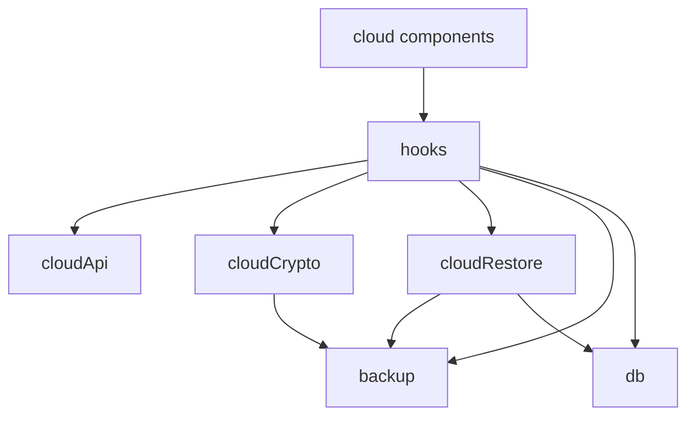

# Markdown Knowledge Board フェーズ2 フロントエンド詳細設計

作成日: 2026-07-30
文書状態: PR8 offline・mobile・accessibility自動化と同期

## 1. 目的

本書は、[フェーズ2基本設計](./phase2-auth-cloud-backup-architecture.md)と[API・認証詳細設計](./phase2-auth-cloud-backup-api-design.md)に基づき、React UI、状態管理、ローカルデータ、暗号化、バックアップ、復元の実装契約を定義する。

> 実装状況（2026年8月3日時点）: PR1～PR7のローカルJSON、暗号化、任意GitHub認証、手動Cloud Backup、明示download、復号preview、safe mergeに加え、PR8でoffline中のローカルedit/save/import/export、明示Retry、cloud送信抑止、390×844のmenu/dialog/result、focus trap／復帰、passphrase表示状態、主要3ブラウザ回帰を接続した。パスフレーズ・token・暗号文は永続化せず、復元はcloud側の最終バックアップ時刻を更新しない。

## 2. テスト設計観点

テストケースを実装する前に、以下の観点を列挙してレビューする。

| 分類 | 観点 | 検証意図 |
| --- | --- | --- |
| 機能 | ローカル操作、任意ログイン、明示バックアップ、明示復元、Sign out、Disconnect | cloud 操作が既存機能を置換せず追加機能として動くこと |
| 非機能 | Web Crypto、機密情報非保持、offline、timeout、性能、アクセシビリティ | 安全性と可用性を端末・ネットワーク差があっても維持すること |
| データ | BackupDocument、envelope、metadata、merge、transaction、Origin 分離 | 欠落、取り違え、破損、無警告上書き、部分反映を防ぐこと |
| UI | application menu、確認・入力・結果 dialog、mobile、focus、aria-live | 状態・危険性・次操作を利用者へ明確に伝えること |

| 区分 | 主なケース |
| --- | --- |
| 正常系 | signed out のローカル利用、保存後ログイン、初回/更新 backup、preview後restore、Sign out/Disconnect |
| 異常系 | 保存失敗、認証timeout、offline、暗号失敗、誤passphrase、破損、API失敗、transaction rollback |
| 境界値 | 0/1/100件以上、12文字passphrase、1 MB超、4,500,000/4,500,001 bytes、同一ID/同一日時/異内容、複数候補 |
| 状態遷移 | dirty→save→redirect、checking→unknown、encrypt→upload、download→preview→apply、失敗→retry |

テストは「ボタンを押せた」ではなく、たとえば「OAuth 遷移前の IndexedDB 保存成功を保証する」「復号失敗時に IndexedDB が1件も変わらない」のように、検証意図を名称と assertion に表す。

## 3. モジュール設計

### 3.1 追加・変更ファイル

```text
src/
  App.tsx                         orchestration と配置のみ
  components/cloud/
    GitHubSection.tsx             application menu 内の状態表示
    SaveBeforeCloudDialog.tsx     Save and Continue / Cancel
    BackupPassphraseDialog.tsx    作成用 passphrase と確認
    RestorePassphraseDialog.tsx   復号用 passphrase
    GistCandidateDialog.tsx       複数候補選択
    RemoteChangedDialog.tsx       revision 競合時の次操作
    RestorePreviewDialog.tsx      merge preview と適用確認
    CloudResultDialog.tsx         backup/restore/disconnect 結果
  hooks/
    useGitHubSession.ts           非同期 session 状態
    useCloudBackup.ts             cloud operation orchestration
  lib/
    backup.ts                     BackupDocument v1 共通処理
    note.ts                       Note生成、ID・timestamp・pin値の正規化
    cloudApi.ts                   same-origin API client
    cloudCrypto.ts                Web Crypto と envelope
    cloudMetadata.ts              user別 non-secret metadata
    cloudRestore.ts               validation、diff、merge plan
    db.ts                         transaction apply を追加
    types.ts                      cloud domain type を追加
```

PR1で`App.tsx`から`BackupDocument`、`createBackupDocument`、`parseBackupNotes`を`src/lib/backup.ts`へ、Note生成と共通値の正規化を`src/lib/note.ts`へ移した。PR2で`cloudRestore.ts`と`db.ts`の復元基盤、PR3で`canonicalJson.ts`と`cloudCrypto.ts`の暗号基盤を追加したが、cloud featureはUI未接続のままとする。ローカル JSON import/export の動作を変えず、クラウド暗号化も同じ BackupDocument を使用する。

### 3.2 依存方向



- UI component から `fetch`、Web Crypto、IndexedDB を直接呼ばない。
- `cloudApi` は暗号化済み bytes と metadata だけを扱う。
- `cloudCrypto` は GitHub、Gist、React を知らない。
- `cloudRestore` は純粋な validation/diff を中心とし、DB 書き込みを分離する。

## 4. 起動・ローカル利用・認証状態

### 4.1 起動順序

```ts
type CloudCapability = "enabled" | "local-only";
```

`CloudCapability`は、`VITE_CLOUD_BACKUP_ENABLED === "true"`かつ現在のOriginが本番2 Originのいずれかに完全一致する場合だけ`enabled`とする。Vercel Previewとlocalhostは`local-only`とし、GitHub sectionをrenderせず、session/cloud APIを呼ばない。frontend判定はUX上の制御であり、backendのProduction環境ゲートを代替しない。

```text
App mount
  +-> IndexedDB load -> notes UI ready
  +-> cloud enabled の場合だけ GET /api/auth/session -> GitHub section only update
  +-> online/offline listeners -> cloud availability only update
```

IndexedDB 読み込みと session 確認は独立して開始する。session response、timeout、offline を待ってから editor を表示してはならない。

local developmentのunit/component/E2Eではtest configでcloud UIを有効にし、`fetch`をstubする。現行のE2EはVite developmentかつloopback Originで`?cloudTest=1`を明示した場合だけGitHub sectionを表示し、認証APIをroute stubする。このtest opt-inはProduction buildでは有効にならない。実GitHub callback、token、Gistを使用しない。実GitHub結合確認はProductionの専用テストアカウントでのみ行う。

### 4.2 session state

```ts
type GitHubSessionState =
  | { status: "checking" }
  | { status: "signed-out" }
  | { status: "signed-in"; user: GitHubUser }
  | { status: "reauthorization-required" }
  | { status: "unavailable"; reason: "offline" | "timeout" | "server" };
```

```text
checking -> signed-out
checking -> signed-in
checking -> reauthorization-required
checking -> unavailable
signed-in -> signed-out                 Sign out / Disconnect
signed-in -> reauthorization-required  token refresh failure
unavailable -> checking                 user Retry / online event後の明示Retry
```

`online` event は表示を更新するだけで、session retry、backup、restore を自動開始しない。利用者が `Retry` または cloud 操作を明示した時だけ通信する。

session が `signed-in` になった直後は `GET /api/cloud-backups` を1回だけ呼び、候補有無、Gist更新日時、revisionなどの metadata を解決してよい。この処理では暗号文本体を取得・復号せず、backup/restoreも開始しない。失敗は GitHub section の metadata unavailable として扱う。

### 4.3 ローカル機能との分離

- cloud state を App 全体の disabled 条件に含めない。
- session error を既存 `dbError` へ設定しない。
- `Backup All Notes`、`Import Backup`、Markdown import/export、Save は cloud state を参照しない。
- signed out、checking、unavailable のいずれでも IndexedDB state と draft を保持する。
- Sign out/Disconnect handler から `deleteNote`、DB delete/clear、local JSON timestamp削除を呼ばない。

### 4.4 offline

- `navigator.onLine` と request error の両方で判断し、`navigator.onLine === true` だけで通信成功を断定しない。
- offline 中は `Cloud Backup` と `Restore from Cloud` を disabled にし、同じ GitHub section 内に `Offline` を表示する。
- ローカル操作は disabled にしない。
- 開いた tab での編集・保存を保証し、完全 offline の reload は保証外であることを help text に記載する。

## 5. GitHub ログインと未保存確認

### 5.1 ログイン開始

```ts
async function startGitHubSignIn(): Promise<void> {
  const canContinue = await confirmSaveBeforeExternalAction("sign-in");
  if (!canContinue) return;
  window.location.assign("/api/auth/github/start?returnPath=%2F");
}
```

未保存変更は `isDirtyRef.current` または未確定 tag input で判定する。未保存がなければ dialog を表示しない。

### 5.2 専用確認契約

現行のノート切替用 dialog が破棄選択を持つ場合でも、ログイン、Cloud Backup、restore apply では次の2択だけを渡す。

```ts
type SaveBeforeCloudChoice = "save" | "cancel";
```

表示文言:

- title: `Save changes before signing in?`
- body: `Signing in with GitHub leaves this page. Save your changes before continuing.`
- primary: `Save and Continue`
- secondary: `Cancel`

`Discard and Continue` は DOM にも作らない。`Save and Continue` は既存 `handleSave(): Promise<boolean>` を呼び、`true` の時だけ OAuth navigation を開始する。`false` または exception の時は draft、選択ノート、focus を維持して editor に留まる。

Cloud Backup と restore apply は同じ component を使用し、title/body の action variant だけを変更する。

### 5.3 callback 後

- `auth=connected` は non-blocking status として表示し、URL query を即時除去する。
- session を再取得するが、backup/restore を呼ばない。
- `auth=error` は GitHub section に表示し、editor/global DB error に送らない。
- callback から戻った draft は保存済みのため、IndexedDB から通常どおり復元する。

## 6. クラウドバックアップ設計

### 6.1 state

```ts
type CloudBackupState =
  | { status: "idle" }
  | { status: "saving-draft" }
  | { status: "awaiting-passphrase" }
  | { status: "encrypting" }
  | { status: "uploading" }
  | { status: "success"; result: CloudBackupMetadata }
  | { status: "remote-changed"; remote: CloudBackupMetadata }
  | { status: "failed"; error: CloudUiError };
```

同一 hook 内で backup/restore の active operation を1件に制限する。ボタン連打、Enter連打、menu 再オープンで二重実行しない。

### 6.2 処理手順

1. signed-in、online、operation idle を確認する。
2. 未保存なら `Save and Continue` / `Cancel` を表示する。
3. `getAllNotes()` で IndexedDB から最新 snapshot を再取得する。
4. 固定済みは `pinnedAt desc, updatedAt desc, id asc`、未固定は `updatedAt desc, id asc` で決定的に並べる。
5. `createBackupDocument(notes, nowIso)` と strict validation を実行する。
6. passphrase と確認入力を受け付ける。
7. browser 内で envelope を生成し UTF-8 bytes 化する。
8. 4,500,000 bytes 以下を確認する。
9. 初回は `POST /api/cloud-backups`、更新は expected revision付き `PUT /api/cloud-backups/update?gistId=...` へ envelope bytesを直接送る。
10. 成功 response 後だけ cloud metadata を更新する。
11. passphrase、入力 field、平文 JSON、derived key 参照を破棄する。

network timeout時は同じ `operationId`、SHA-256、envelope bytesで1回だけ状態確認を兼ねた再送を許可する。APIは保存済みcontent hashを照合して重複作成・二重更新を防ぐ。それ以上は利用者の手動再試行とし、再暗号化や自動Gist作成を行わない。

### 6.3 0件警告

IndexedDB が0件で既存 cloud backup がある場合、passphrase dialog の前に次を表示する。

```text
Replace the cloud backup with an empty backup?
The existing cloud backup contains data. This action cannot be undone from this app.
```

選択肢は `Continue` / `Cancel`。Gist内容は暗号化されているため、既存件数は自動表示できない。「contains data」は利用者が作成済み backup を空 snapshot で置換する意味として表示する。

### 6.4 revision 競合

API が `REMOTE_REVISION_CHANGED` を返した場合は失敗として自動再送しない。

選択肢:

- `Restore from Cloud`: download flow へ移る。自動 apply はしない。
- `Replace Cloud Backup`: 現在 revision を再取得し、強い確認後に `mode: replace` を開始する。
- `Cancel`

置換確認後も API が revision を再確認する。再度変化した場合は同じ conflict 状態へ戻る。

### 6.5 成功 metadata

API 成功後にだけ、現在 GitHub user ID の metadata へ次を保存する。

```ts
type CloudBackupLocalMetadata = {
  gistId: string;
  revision: string;
  updatedAt: string;
  encryptedSize: number;
  sha256: string;
};
```

`Last cloud backup` は `updatedAt` を表示する。現行 `lastBackupAt` と `Last local backup` は local JSON backup として別に維持する。

## 7. クラウド復元設計

### 7.1 state

```ts
type CloudRestoreState =
  | { status: "idle" }
  | { status: "selecting-gist"; candidates: CloudBackupMetadata[] }
  | { status: "downloading" }
  | { status: "awaiting-passphrase"; envelope: EncryptedBackupEnvelope }
  | { status: "decrypting" }
  | { status: "validating" }
  | { status: "preview"; plan: RestorePlan }
  | { status: "saving-draft"; plan: RestorePlan }
  | { status: "applying" }
  | { status: "success"; result: RestoreResult }
  | { status: "failed"; error: CloudUiError };
```

### 7.2 download と復号

1. cached Gist を検証し、0/1/複数候補を解決する。
2. 複数候補は Gist updatedAt、ID末尾、Gist link を表示して利用者に選択させる。
3. content APIから暗号化envelope bytesを直接取得する。
4. responseのbytes上限とSHA-256を検証する。
5. strict envelope parse を行う。
6. passphrase を入力後、browser 内で復号する。
7. BackupDocument validation を完了する。
8. IndexedDB snapshot と比較して RestorePlan を生成する。
9. preview dialog を表示する。

download responseは最大4,500,000 bytesとし、client側でも読み込み後の実測bytesを確認する。serverが返すmetadata headerとbody hashの不一致は復号前に拒否する。

### 7.3 BackupDocument validation

次のいずれかに違反した場合、preview を作らず IndexedDB を変更しない。

- object、`app === "markdown-knowledge-board"`、`version === 1`
- `createdAt` が有効な ISO 8601 UTC
- `noteCount` が non-negative integer で `notes.length` と一致
- `notes` の各 item が `id`、`title`、`tags`、`updatedAt`、`markdown` を持ち、任意の `pinnedAt`、`customMetadata`を含む許可済みschemaに従う
- `id` が空でなく重複しない
- `title` と `markdown` が string、`tags` が string array
- `updatedAt` が finite non-negative integer
- `pinnedAt` が存在する場合は finite non-negative integer
- `customMetadata` が存在する場合は`{ key: string; value: FrontmatterValue }[]`であり、key、値、ネスト、要素数が要件8.1の制約を満たす
- Markdown/frontmatter parse 後の ID が wrapper ID と矛盾しない
- JSON 全体が暗号化後サイズ上限から合理的に導ける範囲

unknown optional field は version 1 では拒否せず無視するのではなく、schema の許可リストに従う。互換追加が必要な場合は schema/version 方針を更新してから実装する。

### 7.4 内容同一性

同一内容判定は `updatedAt` を除いた正規化 Note で行う。

```ts
type ComparableNote = {
  id: string;
  title: string;
  body: string;
  tags: string[];
  pinnedAt?: number;
  marp: MarpSettings;
  customMetadata: CustomMetadataEntry[];
};
```

- tag の順序と文字大小は現行データとして保持し、完全一致で比較する。
- `marp` 未指定は `DEFAULT_MARP_SETTINGS` に展開して比較する。
- `pinnedAt` 未指定は未固定として比較し、クラウド復元で固定状態だけが異なる場合も無確認で上書きしない。
- `customMetadata` 未指定は空配列へ正規化し、key順、配列順、object内容を保持して比較する。メタデータだけが異なる場合も同一扱いしない。
- object key 順を固定した canonical JSON の SHA-256 を fingerprint とする。
- fingerprint は比較用であり認証・暗号鍵に使用しない。

### 7.5 merge plan

```ts
type RestoreAction = "added" | "updated" | "skipped" | "conflicted";

type RestorePlanItem = {
  id: string;
  title: string;
  action: RestoreAction;
  localUpdatedAt?: number;
  cloudUpdatedAt: number;
  reason: string;
  noteToApply?: Note;
};
```

判定順:

| 条件 | action | 適用 |
| --- | --- | --- |
| local に同じ ID がない | `added` | cloud note を追加 |
| fingerprint が同じ | `skipped` | 何もしない |
| fingerprint が異なり cloud.updatedAt > local.updatedAt | `updated` | cloud note で更新 |
| fingerprint が異なり cloud.updatedAt < local.updatedAt | `conflicted` | local を保持 |
| fingerprint が異なり updatedAt が同じ | `conflicted` | local を保持 |

Gist にない local note は plan item に含めず保持する。初期実装は conflicted item の個別上書き選択を提供しない。

### 7.6 preview

preview dialog は次を表示する。

- cloud backup 作成日時
- cloud note count
- `added`、`updated`、`skipped`、`conflicted` の件数
- conflicted の title、local/cloud updatedAt、reason
- `Apply Safe Merge` / `Cancel`

`Apply Safe Merge` の直前に未保存変更を再確認する。preview 中に editor draft が変更され得るため、download 開始時の一度だけでは不十分である。保存失敗または Cancel では plan を保持したまま editor に留まり、IndexedDB を変更しない。

### 7.7 transaction apply

`src/lib/db.ts` に次を追加する。

```ts
export async function applyNotesTransaction(notes: Note[]): Promise<void> {
  const db = await requireDb();
  const tx = db.transaction("notes", "readwrite");
  for (const note of notes) {
    await tx.store.put(note);
  }
  await tx.done;
}
```

実装では `requireDb` を共通化し、transaction callback 外で別 DB request を混ぜない。`added` と `updated` の `noteToApply` だけを1 transactionで putする。1件でも失敗したら transaction 全体を abort/rollbackし、React state は IndexedDB の再読み込み結果へ戻す。

成功結果:

```ts
type RestoreResult = {
  added: number;
  updated: number;
  skipped: number;
  conflicted: number;
  failed: 0;
};
```

transaction 失敗時は適用0件として `failed` に対象件数を表示し、部分成功を表示しない。restore 成功で cloud backup日時を更新しない。

## 8. 暗号化詳細設計

### 8.1 envelope

```ts
type EncryptedBackupEnvelope = {
  app: "markdown-knowledge-board";
  envelopeVersion: 1;
  crypto: {
    algorithm: "AES-GCM";
    keyLength: 256;
    kdf: "PBKDF2-SHA-256";
    iterations: number;
    salt: string;
    iv: string;
  };
  ciphertext: string;
};
```

- `salt`: 16 random bytes、base64url no padding
- `iv`: 12 random bytes、base64url no padding
- AES-GCM tag: 128 bit。Web Crypto ciphertext末尾に含む
- `ciphertext`: ciphertext + tag の base64url no padding
- plaintext: BackupDocument v1 の canonical UTF-8 JSON

### 8.2 passphrase

- 永続化、analytics、log、URL、API request に含めない。
- `String.prototype.normalize("NFC")` 後の Unicode code point 数を数える。
- 12 code points 未満を拒否する。前後空白を trim しない。
- 作成時は正規化後の2入力が一致することを確認する。
- 復元時は正誤を事前判定せず、AES-GCM 復号結果で検証する。
- error は `The passphrase is incorrect or the backup is damaged.` とし、誤passphraseと改ざんを断定しない。
- 初回作成時に `If you lose this passphrase, the backup cannot be recovered.` を表示する。

### 8.3 鍵導出

```ts
const keyMaterial = await crypto.subtle.importKey(
  "raw",
  new TextEncoder().encode(normalizedPassphrase),
  "PBKDF2",
  false,
  ["deriveKey"]
);

const key = await crypto.subtle.deriveKey(
  {
    name: "PBKDF2",
    hash: "SHA-256",
    salt,
    iterations: PBKDF2_ITERATIONS_V1,
  },
  keyMaterial,
  { name: "AES-GCM", length: 256 },
  false,
  ["encrypt", "decrypt"]
);
```

`extractable` は false とする。`PBKDF2_ITERATIONS_V1` は600,000回を計測開始値とし、desktop/mobile実測後に version 1 の固定値としてコードと本書へ反映する。version 1 公開後に値を変える場合は `envelopeVersion` を上げ、過去値を exact allowlist で復号する。

### 8.4 AAD

header 改ざんを検出するため、次の順序で再構成した canonical JSON の UTF-8 bytes を `additionalData` に使用する。

```ts
{
  app,
  envelopeVersion,
  crypto: { algorithm, keyLength, kdf, iterations, salt, iv }
}
```

暗号化・復号で同じ builder を共有する。`tagLength: 128` を明示する。

### 8.5 random と再利用禁止

- `crypto.getRandomValues` 以外の乱数 fallback を持たない。
- backup ごとに salt/IV を新規生成する。
- operation retry は暗号化済み同一 envelope bytes を再送し、同じ鍵/IVで平文を再暗号化しない。
- 新しい backup 操作は同一 passphrase でも salt/IV を再生成する。

### 8.6 メモリと処理中断

- passphrase は dialog local state にだけ保持し、close/success/failureで空文字へ上書きして component を unmountする。
- JavaScript string/ArrayBuffer の完全なゼロ化は保証できないことを既知制約とする。
- derived `CryptoKey` を module global、React context、localStorageへ置かない。
- 同一操作の再試行中だけ closure 内で使用し、operation終了で参照を破棄する。
- tab close では永続化されない。

### 8.7 性能

- `encrypting` / `decrypting` を即時描画してから処理を開始する。
- PBKDF2 と AES は async Web Crypto を使用する。
- JSON serialization、base64url変換、SHA-256で200 ms超の long task が発生する場合は Web Worker へ移す。
- 100件、1 MB、4.5 MB近傍を desktop/mobileで測定する。
- progress を推測百分率で表示せず、`Encrypting`、`Uploading`、`Downloading`、`Decrypting` などの処理段階を表示する。

## 9. localStorage metadata

### 9.1 schema

key: `mkb.cloud-backup.v1`

```ts
type CloudMetadataStoreV1 = {
  version: 1;
  users: Record<
    string,
    {
      gistId: string;
      revision: string;
      updatedAt: string;
      encryptedSize: number;
      sha256: string;
    }
  >;
};
```

record key は GitHub numeric user ID の decimal string。token、login、passphrase、鍵、暗号文を保存しない。

### 9.2 lifecycle

- login 時は現在 user ID の record だけを読む。
- cached Gist を API が検証するまで選択済みと断定しない。
- Sign out は record を保持するが UI に表示しない。
- Disconnect は現在 user ID の record を削除する。
- 別 user login では以前 user の record を参照しない。
- Gist 404または識別不一致なら現在 user の cached record を削除して再検出する。
- localStorage parse/write失敗は cloud metadata cache を無効扱いにし、IndexedDB と local操作へ伝播させない。

2つの本番 Origin は同じ key 名でも別 storage になる。自動同期は行わない。

## 10. API client

### 10.1 契約

- relative URLだけを使用し、任意 API base URL を利用者入力から作らない。
- `credentials: "same-origin"`、`redirect: "error"` を既定とする。OAuth start は navigation なので例外。
- state-changing request に memory 上の CSRF token を付ける。
- JSON success/error envelope と `X-Request-Id` を検証する。
- 401は session state を `reauthorization-required` にするが自動 loginしない。
- retryable error でも自動cloud operation再開はせず、同一operation/hashのtimeout確認を除いて手動再試行とする。

### 10.2 timeout

`AbortController` で session 5秒、metadata 15秒、encrypted upload/download 30秒を設定する。component unmount と Cancel でも abort する。abort後の late response が state を successへ戻さないよう operation ID を比較する。

### 10.3 tab 間直列化

session refresh、backup complete、restore apply は `navigator.locks` を使う。

```text
mkb-github-session
mkb-cloud-backup-<gistId|new>
mkb-restore-apply
```

lock 未対応では同一tabのsingle-flightだけを保証する。別tab競合はrevision確認とIndexedDB transactionで検出・安全側へ倒す。

## 11. UI 詳細

### 11.1 application menu

既存 menu を次の順にする。

```text
Local data
  Backup All Notes
    Last local backup: ...
  Import Backup

GitHub
  Checking GitHub connection…             checking
  Sign in with GitHub                      signed out
  Connected as @login                      signed in
  Cloud Backup                             signed in + online
  Restore from Cloud                       signed in + online
  Last cloud backup: ... / No cloud backup
  Sign out
  Disconnect GitHub
  Offline / Reauthorization required       状態に応じて表示
```

現行 `Last backup` は `Last local backup` へ明確化する。local menu item は GitHub状態で disabled にしない。処理中はラベル領域の幅・高さを維持し、menu全体をレイアウトシフトさせない。

Vercel secondary Origin では GitHub section 下部に次を表示する。

```text
Local data is stored separately for this address.
Open the primary address
```

link は `https://mkb.bamboosato.com/`。自動redirectしない。

Vercel PreviewとlocalhostではGitHub section全体を表示しない。`Backup All Notes`と`Import Backup`を含むローカルmenuは通常どおり表示する。Preview URLから`/api/auth/*`または`/api/cloud-backups*`を直接呼んでもbackendが拒否する前提とする。

### 11.2 passphrase dialog

- backup: `Passphrase`、`Confirm passphrase`、表示切替、説明、`Encrypt and Upload`、`Cancel`
- restore: `Passphrase`、表示切替、`Decrypt Backup`、`Cancel`
- `autocomplete="new-password"` を作成、`autocomplete="current-password"` を復元で使用する。
- 初期focusは先頭passphrase input。
- Caps Lock 検出は補助表示に留める。
- pasteを禁止しない。
- 表示切替 button に `aria-pressed` と動的 `aria-label` を付ける。
- validation error と input を `aria-describedby` で関連付ける。

### 11.3 dialog 共通

- `role="dialog"`、`aria-modal="true"`、labelledby/describedby を設定する。
- Tab focus trap、Escape の安全な Cancel、閉じた後の操作元focus復帰を実装する。
- destructive/remote replace は Escape で実行せず Cancel する。
- async 処理中は閉じる操作の扱いを明示し、abort可能段階だけ Cancel を許可する。
- 390 px幅で左右16 px以上の余白を確保し、max-height内をscroll可能にする。

### 11.4 status と error

- `aria-live="polite"` に段階変化、`role="alert"` に失敗結果を通知する。
- cloud error は GitHub section または CloudResultDialog に表示する。
- DB error bannerへcloud errorを混ぜない。
- error codeに応じて `Retry`、`Sign in with GitHub`、`Restore from Cloud`、`Backup All Notes` の次操作を1つ以上提示する。
- request ID は詳細欄に表示し、通常本文を圧迫しない。

### 11.5 Disconnect 確認

```text
Disconnect GitHub?
This removes the connection from this browser. Local notes and the encrypted Gist backup will not be deleted.
```

選択肢は `Disconnect GitHub` / `Cancel`。成功後は signed out 表示へ戻す。token失効失敗時は GitHub settings link を結果dialogに表示する。

## 12. エラー分類

```ts
type CloudUiError = {
  kind:
    | "auth"
    | "network"
    | "rate-limit"
    | "remote-changed"
    | "crypto"
    | "unsupported"
    | "size"
    | "storage"
    | "unknown";
  message: string;
  retryable: boolean;
  requestId?: string;
};
```

| 条件 | UI | IndexedDB |
| --- | --- | --- |
| session timeout/offline | unavailable/Offline | 変更なし、local継続 |
| 401/権限取消 | Reauthorization required | 変更なし |
| 404 Gist | No cloud backup、再検出 | 変更なし |
| 429 | reset時刻と手動Retry | 変更なし |
| revision change | Remote backup changed | 変更なし |
| crypto failure | passphraseまたは破損案内 | 変更なし |
| unsupported version | 対応版案内 | 変更なし |
| 4.5 MB超 | local JSON案内 | 変更なし |
| apply failure | Restore failed、rollback | transaction前状態 |

## 13. テスト自動化設計

### 13.1 レイヤー

| レイヤー | 対象 | 手段 |
| --- | --- | --- |
| unit | envelope、base64url、passphrase、schema、merge matrix、metadata | Vitest、固定vector |
| DB integration | transaction commit/rollback、duplicate/invalid data | Vitest + fake-indexeddb |
| component | dialog choice、focus、aria、state表示 | Testing Library + user-event |
| E2E stub | OAuth戻り、API error、offline、mobile、Origin表示 | Playwright route stub |
| Preview policy | local機能、cloud UI非表示、API拒否 | Preview相当Origin + stub backend |
| GitHub integration | 実OAuth、Gist create/update/raw restore/revoke | 専用account、serial実行 |
| production smoke | 2 Origin、callback、local回帰 | 破壊しない専用データ |

PR8の自動E2EはChromiumで全機能を実行し、Phase 2のauth／backup／restore／readinessをFirefoxとWebKitでも直列実行する。ChromiumとFirefoxのofflineはPlaywrightのnetwork-level offlineを使用する。Playwright WebKitはnetwork-level offline中にテスト用file inputを読み出せないため、WebKitだけは`navigator.onLine`と`offline`／`online`イベントでアプリ状態を再現し、cloud mutationが0回であることを別途assertする。これは実mobile計測やProduction実経路の代替証跡にはしない。

### 13.2 正常系

| ID | 前提 | 操作 | 検証意図 |
| --- | --- | --- | --- |
| FE-N-01 | signed out | create/edit/save/import/export | 認証なしで現行local機能が完結すること |
| FE-N-02 | dirty draft、保存成功 | Sign in | 保存完了後だけOAuthへ遷移すること |
| FE-N-03 | signed in、Gistなし | Cloud Backup | browser暗号化後に1 Gist作成すること |
| FE-N-04 | signed in、既存Gist | Cloud Backup | expected revisionで同じGistを更新すること |
| FE-N-05 | 別browser、local空 | Restore | preview後にaddedをtransaction適用すること |
| FE-N-06 | local新旧混在 | Restore | added/updated/skipped/conflictedを規則どおり分類すること |
| FE-N-07 | signed in | Sign out | local noteとmetadataを保持しcloud操作だけ隠すこと |
| FE-N-08 | signed in | Disconnect | local note/Gistを保持し当該user metadataを削除すること |

### 13.3 異常系

| ID | 注入 | 期待 | 検証意図 |
| --- | --- | --- | --- |
| FE-E-01 | Save失敗 | OAuth/API未呼出、draft維持 | 未保存編集を失わないこと |
| FE-E-02 | auth確認timeout | editor利用可、cloud unavailable | 認証障害でlocalを止めないこと |
| FE-E-03 | encrypted upload失敗 | cloud日時不変、local不変 | 失敗を成功表示しないこと |
| FE-E-04 | 誤passphrase/改ざん | 同じ安全なerror、DB不変 | 情報漏えいと誤反映を防ぐこと |
| FE-E-05 | unsupported envelope | apply不可 | 未知形式を部分採用しないこと |
| FE-E-06 | transaction途中失敗 | 全rollback、結果failed | 部分復元を防ぐこと |
| FE-E-07 | offline→online | 自動cloud操作なし | 再接続時の意図しないuploadを防ぐこと |
| FE-E-08 | late response | 新operation stateを上書きしない | timing依存の誤表示を防ぐこと |
| FE-E-09 | Vercel Preview Origin | GitHub section非表示、session API未呼出 | Previewを認証・クラウド環境として使用しないこと |

### 13.4 境界値・データ

| ID | データ | 期待 | 検証意図 |
| --- | --- | --- | --- |
| FE-B-01 | passphrase 11/12 code points | 11拒否、12許可 | Unicode境界を正しく扱うこと |
| FE-B-02 | canonically equivalent Unicode | NFC後に一致 | 入力方式差で復号不能にしないこと |
| FE-B-03 | 0 notes + existing Gist | 強い置換警告 | 空backup事故を防ぐこと |
| FE-B-04 | 1 MB超 envelope | server raw URL経路で直接取得成功 | truncated API contentを使わないこと |
| FE-B-05 | 4,500,000/4,500,001 bytes | 成功/拒否 | 上限境界を保証すること |
| FE-B-06 | duplicate ID/noteCount不一致 | preview前に拒否 | 破損backupを適用しないこと |
| FE-B-07 | 同一ID・同一時刻・異内容 | conflicted | 無警告上書きを防ぐこと |
| FE-B-08 | 2 candidate Gists | 選択dialog | 自動誤選択を防ぐこと |
| FE-B-09 | nested/Unicode `customMetadata` | 値と順序を保持してroundtrip | 現行メタデータを欠落させないこと |
| FE-B-10 | 本文同一・`customMetadata`だけ異なる | conflicted | メタデータの無警告上書きを防ぐこと |
| FE-B-11 | unsafe key、21階層、1,001要素 | preview前に拒否、DB不変 | 不正・過大なメタデータを適用しないこと |

### 13.5 状態遷移・競合

| ID | タイミング | 期待 | 検証意図 |
| --- | --- | --- | --- |
| FE-S-01 | dialog表示後Cancel | 元focus/draft維持 | Cancelを無副作用にすること |
| FE-S-02 | preview後にdraft編集 | apply前に再度保存確認 | preview期間中の変更を失わないこと |
| FE-S-03 | backup中に二重click | operation 1件 | 重複Gist/更新を防ぐこと |
| FE-S-04 | 別端末がrevision更新 | replaceせずconflict表示 | remote新データを守ること |
| FE-S-05 | Sign outとbackup同時操作 | lock後signed out、成功誤表示なし | session競合を安全に収束させること |

### 13.6 UI・環境差異

- Chromium、Firefox、WebKit の現行安定版で Web Crypto、Cookie、IndexedDB を確認する。
- Windows/macOS、desktop 1440×900、mobile 390×844、狭い高さでmenu/dialogを確認する。
- keyboardのみ、screen reader semantics、reduced motion、200% zoomを確認する。
- primary/Vercel Production Originで localStorage、IndexedDB、Cookieが共有されないことを別contextで確認する。
- Vercel Preview相当Originではローカル機能だけが利用でき、cloud UI/API/本番secretへ到達しないことを確認する。
- slow 3G、offline切替、429、500、timeoutをstubし、spinnerが終了することを確認する。

GitHub実アカウント、同一Gist、同一実機を操作するscriptはserialで実行する。stub E2Eを並列化する場合もport、browser context、storage、test dataを分離する。

### 13.7 フレーク仮説と証跡

| 症状 | 仮説 | 証跡/対策 |
| --- | --- | --- |
| OAuth後にsigned out | callback Cookie/Origin/clock差 | Origin、safe code、Cookie属性、clockを記録 |
| timeout後に成功不明 | late response/GitHub更新済み | operationId、revision、hash比較結果を記録 |
| revision testが不定 | 共有Gistの並列更新 | serial化、before/after revision保存 |
| mobile dialog timeout | focus trap/viewport外 | screenshot、DOM snapshot、activeElement保存 |
| 復元件数が揺れる | DB初期化不足/前test残存 | test前にOrigin別DBを明示初期化 |

不具合分析はテスト観点不足、データ問題、環境問題、実装問題へ分類し、検出できた/できなかった理由と再発防止を残す。

## 14. 実装順序

1. `backup.ts` 抽出と現行local JSON回帰
2. `cloudRestore.ts` schema/diff と DB transaction unit test
3. `cloudCrypto.ts` 固定vector、性能測定、version 1定数確定
4. API client/session hook と signed-out/checking UI
5. OAuth、Sign out、Disconnect
6. metadata/Gist discovery/candidate UI
7. raw envelope upload と Cloud Backup
8. raw envelope download、passphrase、preview、transaction apply
9. offline/error/accessibility/mobile E2E
10. Preview local-only境界とProduction secret scope確認
11. Production 2 Origin・実GitHub結合・4.5 MB境界・ログ非漏えい確認

各段階で未ログインlocal回帰を実行する。`VITE_CLOUD_BACKUP_ENABLED`はProduction buildだけでtrueとし、Previewでは常にlocal-onlyとして動作させる。後段が未完成でもfeature flagをoffにすれば現行local機能だけで動作できる状態を保つ。

## 15. 要件トレーサビリティ

| 要件 | 設計節 |
| --- | --- |
| `LOCAL-001`～`LOCAL-008` | 4、9、11、13 |
| `AUTH-001`～`AUTH-009` | 4、5、10～11 |
| `AUTH-010`～`AUTH-015` | 5.1～5.2 |
| `SESSION-001`～`SESSION-005` | 4.1～4.2、10 |
| `SIGNOUT-001`～`SIGNOUT-004` | 4.3、9.2、11.1 |
| `DISCONNECT-001`～`DISCONNECT-007` | 4.3、9.2、11.5 |
| `BACKUP-001`～`BACKUP-019` | 6、8～10 |
| `RESTORE-001`～`RESTORE-020` | 7～10 |
| `OFFLINE-001`～`OFFLINE-005` | 4.4、10～13 |
| `ENV-001`～`ENV-005` | 4.1、10～11、13～14 |
| `CRYPTO-001`～`CRYPTO-011` | 8 |
| UI/エラー/非機能 | 10～13 |

## 16. 参照資料

- [フェーズ2要件定義](./phase2-auth-cloud-backup-requirements.md)
- [フェーズ2基本設計](./phase2-auth-cloud-backup-architecture.md)
- [API・認証詳細設計](./phase2-auth-cloud-backup-api-design.md)
- [現行設計仕様](./design-spec.md)
- [W3C: Web Cryptography API](https://www.w3.org/TR/WebCryptoAPI/)
