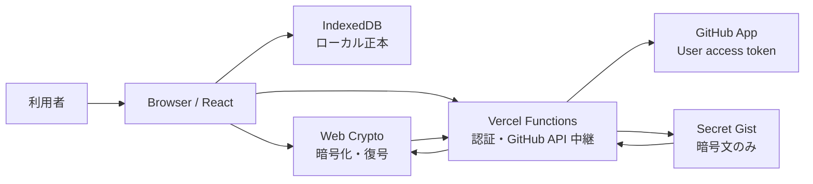

# Markdown Knowledge Board フェーズ2 認証・クラウドバックアップ要件定義

作成日: 2026-07-29
状態: 合意済み方針を反映した初版

## 1. 文書の目的

本書は、Markdown Knowledge Board の次フェーズとして、任意の GitHub ログインと GitHub Gist を利用した暗号化クラウドバックアップを追加するための要件を定義する。

現行アプリは IndexedDB を保存先とするローカル専用アプリであり、現行仕様は [design-spec.md](./design-spec.md) に記載されている。本フェーズではローカル利用を引き続き中心に置き、GitHub 連携を追加機能として分離する。

本書における「フェーズ2」は、認証・クラウドバックアップ導入計画上のフェーズ名である。既存文書に記載された UI/UX 改善の Phase 番号とは別の区分として扱う。

## 2. 採用方針サマリー

| No. | 方針 | 決定内容 |
| --- | --- | --- |
| 1 | ローカル優先 | IndexedDB を常にローカルデータの正本とする。GitHub 障害でローカル機能を止めない。 |
| 2 | 任意認証 | GitHub ログインを必須にせず、アプリ起動時にログイン画面へ強制遷移しない。 |
| 3 | 手動バックアップ | ログイン完了時や起動時に、自動アップロードまたは自動復元を行わない。 |
| 4 | 暗号化 | ノートデータはブラウザ内で暗号化してから Gist へ送信する。Gist に平文を保存しない。 |
| 5 | 安全な復元 | 初期実装は安全なマージ復元とし、ローカルノートの自動削除や無確認上書きを行わない。 |
| 6 | 未保存保護 | ログイン開始時に未保存変更がある場合は `Save and Continue` / `Cancel` を確認する。 |
| 7 | データ保持 | Sign out、GitHub 連携解除、認証エラーのいずれでもローカルノートを削除しない。 |
| 8 | Gist 保持 | GitHub 連携解除時に Gist 上のバックアップを自動削除しない。 |
| 9 | オフライン継続 | 読み込み済みのアプリでは、通信切断後もローカル編集と保存を継続可能にする。 |
| 10 | UI 言語 | 現行仕様に合わせ、利用者に表示する UI 文言は英語とする。 |

本フェーズで扱う Gist は「同期先」ではなく、利用者が明示的に作成・更新する暗号化スナップショットである。

## 3. テスト設計観点

詳細要件とテストケースを定義する前に、本フェーズで優先するテスト観点を固定する。

### 3.1 観点一覧

| 分類 | 主な観点 | まず防ぐべき不具合 |
| --- | --- | --- |
| 機能観点 | 未ログイン利用、ログイン、Sign out、連携解除、手動バックアップ、手動復元 | 認証状態によってローカル機能が使用不能になること |
| 非機能観点 | セキュリティ、可用性、オフライン、性能、API 制限、複数端末競合 | 平文やトークンの漏えい、通信障害による操作不能 |
| データ観点 | 保存済み／未保存、暗号形式、重複、競合、破損、旧形式、サイズ | 復元や上書きによるローカルデータ消失 |
| UI 観点 | 非ブロッキング表示、確認、結果、エラー、モバイル、アクセシビリティ | 成功・失敗・対象データを利用者が誤認すること |

### 3.2 正常系・異常系・境界値・状態遷移

| 区分 | 検証対象 |
| --- | --- |
| 正常系 | 未ログインでの全ローカル操作、ログイン成功、クラウドバックアップ成功、安全なマージ復元、Sign out、再ログイン |
| 異常系 | 認証キャンセル、認証エラー、401、403、404、通信切断、タイムアウト、API 制限、暗号パスフレーズ誤り、Gist 破損、IndexedDB 書き込み失敗 |
| 境界値 | 0件、1件、多数ノート、空本文、長文、1 MB 超、4.5 MB 上限、同一 ID・同一日時・異内容、複数候補 Gist、別 GitHub アカウント |
| 状態遷移 | 認証状態、未保存状態、バックアップ処理状態、復元処理状態、オンライン／オフライン切替、再認証 |

### 3.3 前提条件と実行方針

- ローカル機能テストは未ログイン状態から開始できるようにする。
- クラウド結合テストは専用の GitHub テストアカウントと専用 Gist を使用する。
- 同一 Gist を更新するテストは並列実行せず、実行前後のリビジョンを記録する。
- テストごとに IndexedDB、localStorage、認証 Cookie、対象 Gist の前提状態を明示する。
- GitHub API は成功、認証切れ、権限不足、Not Found、レート制限、タイムアウトを再現可能な形でスタブ化する。
- 実 GitHub 結合テストとスタブ E2E を分離し、失敗時にアプリ、認証基盤、GitHub API のどこで失敗したか判別できるログを残す。
- ログにはノート本文、暗号パスフレーズ、暗号鍵、GitHub トークンを出力しない。

## 4. スコープ

### 4.1 対象

- 任意の GitHub ログイン
- GitHub 認証状態の確認
- Sign out
- GitHub 連携解除
- GitHub Gist への暗号化バックアップ
- GitHub Gist からの復号・プレビュー・安全なマージ復元
- ローカル JSON バックアップとクラウドバックアップの状態分離
- 認証・クラウド操作のエラー表示
- 読み込み済みアプリにおけるオフライン編集
- デスクトップおよびモバイル UI

### 4.2 対象外

- 自動同期、定期バックアップ、バックグラウンドバックアップ
- ログイン直後や起動直後の自動アップロード／自動復元
- ノート単位の双方向同期
- 複数人での共同編集、Gist 共有
- Gist の自動削除
- Gist 履歴を選択する世代管理 UI
- クラウド内容によるローカル全置換
- 暗号パスフレーズの再発行・復旧
- GitHub 以外の認証プロバイダー、クラウドプロバイダー
- Service Worker による完全オフライン新規起動・再読み込み
- GitHub Repository を保存先にする機能

## 5. 用語

| 用語 | 定義 |
| --- | --- |
| ローカルデータ | IndexedDB の `notes` store に保存されたノート。常にローカル側の正本とする。 |
| 未保存変更 | `draft` または `dirty` 状態の編集内容、および確定前のタグ入力。 |
| ローカル JSON バックアップ | 既存の `Backup All Notes` でダウンロードする JSON ファイル。 |
| クラウドバックアップ | ブラウザ内で暗号化し、専用 Secret Gist に保存するスナップショット。 |
| 復元 | クラウドバックアップを復号し、内容を確認した後、ローカルデータへ安全にマージする操作。 |
| Sign out | 現在のアプリ認証セッションを終了する操作。GitHub 上の Gist とローカルノートは保持する。 |
| GitHub 連携解除 | アプリが保持する GitHub 認証情報と連携情報を破棄し、可能な範囲で GitHub 側の認可も取り消す操作。Gist とローカルノートは保持する。 |
| クラウドリビジョン | Gist の更新を識別する ID、履歴バージョン、または更新日時を含む識別情報。 |

## 6. システム構成

### 6.1 構成方針



- フロントエンドは React、TypeScript、Vite の現行構成を維持する。
- ローカルノートは IndexedDB に保存する。
- 暗号化・復号はブラウザの Web Crypto API を利用する。
- GitHub 認証のコード交換、トークン更新、GitHub API 呼び出しは Vercel Functions 等のサーバー側で行う。
- GitHub App は User access token を使用し、必要最小限の `Gists: write` ユーザー権限を持つ。
- ブラウザ JavaScript から GitHub access token、refresh token、client secret を参照できない構成にする。
- サーバーは Markdown 平文と暗号パスフレーズを受け取らない。クラウド操作では暗号文だけを中継する。

### 6.2 データ境界

| データ | ブラウザ | アプリサーバー | GitHub Gist |
| --- | --- | --- | --- |
| Markdown 平文 | 取り扱う | 取り扱わない | 保存しない |
| 暗号パスフレーズ | 入力・鍵導出に使用 | 送信しない | 保存しない |
| 導出鍵 | メモリ上のみ | 送信しない | 保存しない |
| 暗号文 | 生成・復号 | 中継可能 | 保存する |
| GitHub token | JavaScript から参照不可 | 安全に管理 | GitHub が発行・検証 |
| GitHub login、avatar URL | 表示に必要な範囲で保持可能 | セッション管理に使用可能 | GitHub が保持 |

### 6.3 本番ドメイン・認証 URL

| 項目 | URL | 扱い |
| --- | --- | --- |
| Primary / canonical application URL | `https://mkb.bamboosato.com/` | 通常案内する独自ドメイン |
| Secondary Vercel application URL | `https://markdown-knowledge-board.vercel.app/` | 引き続き有効な Vercel URL |
| GitHub App Homepage URL | `https://mkb.bamboosato.com/` | GitHub App の代表 URL |
| Primary callback URL | `https://mkb.bamboosato.com/api/auth/github/callback` | 独自ドメインから開始した認証の戻り先 |
| Secondary callback URL | `https://markdown-knowledge-board.vercel.app/api/auth/github/callback` | Vercel URL から開始した認証の戻り先 |

- 2つの application URL はどちらもアプリを提供し、片方を無効化または一律リダイレクトしない。
- OAuth 開始時の origin を許可済みサーバー側 state と関連付け、認証完了後は認証を開始した origin の callback URL へ戻す。
- OAuth 完了後のアプリ内戻り先は、認証を開始した同一 origin 内の相対パスだけを許可する。
- callback URL を任意の query、未検証の `Host` / `X-Forwarded-Host`、任意の環境変数値から組み立てない。
- session Cookie は各 origin の host-only Cookie とし、`Domain=.bamboosato.com` を指定しない。
- IndexedDB、localStorage、session Cookie は origin ごとに分離される。2つの URL 間でローカルノート、バックアップ日時、認証状態が自動共有されると利用者へ誤認させない。
- GitHub認証とクラウドバックアップは上記2つのProduction Originだけで提供する。Vercel Preview deploymentとlocalhostはcallback allowlistへ登録しない。

## 7. 機能要件

### 7.1 ローカル利用

| ID | 要件 |
| --- | --- |
| LOCAL-001 | 未ログイン状態でも、Markdown ノートの作成・編集・閲覧・保存・削除を利用可能とする。 |
| LOCAL-002 | 未ログイン状態でも、Markdown エクスポート、Markdown インポート、ローカル JSON バックアップ、JSON インポートを利用可能とする。 |
| LOCAL-003 | IndexedDB の読み込みを GitHub 認証確認より先に、または独立して開始する。 |
| LOCAL-004 | 認証確認中、認証エラー、GitHub API エラー、サーバーエラーでローカル機能を disabled にしない。 |
| LOCAL-005 | アプリ起動時にログイン専用画面へ強制遷移しない。 |
| LOCAL-006 | GitHub 機能の追加後も IndexedDB をローカルデータの正本とする。 |
| LOCAL-007 | Sign out または GitHub 連携解除によって IndexedDB のノートを削除しない。 |
| LOCAL-008 | `mkb.bamboosato.com` と `markdown-knowledge-board.vercel.app` は異なる origin であるため、IndexedDB と localStorage のデータを自動共有しない。origin 間の移行にはローカル JSON バックアップまたはクラウドバックアップを使用する。 |

### 7.2 GitHub ログイン

| ID | 要件 |
| --- | --- |
| AUTH-001 | GitHub ログインは利用者が `Sign in with GitHub` を実行した場合のみ開始する。 |
| AUTH-002 | GitHub App の User access token を発行する Web Application Flow を使用する。 |
| AUTH-003 | 認証要求には推測困難な `state` を付与し、コールバックで一致を検証する。 |
| AUTH-004 | 許可済みのコールバック URL 以外へリダイレクトしない。本番環境では 6.3 に記載した2つの callback URL だけを許可する。 |
| AUTH-005 | ログイン完了後は元のアプリ画面へ戻る。ログイン専用画面を常設しない。 |
| AUTH-006 | ログイン完了時にクラウドバックアップまたは復元を自動実行しない。 |
| AUTH-007 | ログイン完了後、アカウント情報とクラウドバックアップの有無・更新日時などのメタデータは取得可能とする。ただし暗号文の復号とローカル反映は行わない。 |
| AUTH-008 | GitHub App の権限は Gist の読み書きに必要な最小権限に限定し、Repository 権限を要求しない。 |
| AUTH-009 | GitHub token はブラウザの localStorage、sessionStorage、IndexedDB に保存しない。 |

#### 7.2.1 未保存変更がある場合

| ID | 要件 |
| --- | --- |
| AUTH-010 | ログイン開始時に未保存変更がある場合、確認ダイアログを表示する。 |
| AUTH-011 | 選択肢は `Save and Continue` と `Cancel` の2つとし、`Discard and Continue` は表示しない。 |
| AUTH-012 | `Save and Continue` は IndexedDB への保存が成功した場合だけ認証遷移を開始する。 |
| AUTH-013 | 保存に失敗した場合は認証遷移を開始せず、編集内容を維持して編集画面に留まる。 |
| AUTH-014 | `Cancel` は認証遷移を開始せず、編集内容を維持して編集画面に留まる。 |
| AUTH-015 | 未保存変更がない場合は確認ダイアログを表示せず、認証を開始する。 |

### 7.3 認証状態確認

| ID | 要件 |
| --- | --- |
| SESSION-001 | アプリ起動時の認証確認はローカル画面をブロックしない非同期処理とする。 |
| SESSION-002 | 認証確認中もローカル編集と保存を利用可能とする。 |
| SESSION-003 | access token の期限切れ時は、サーバー側で安全に更新可能な場合だけ refresh token を使用する。 |
| SESSION-004 | 更新不能、認可取消、権限不足の場合は `Reauthorization required` とし、再ログイン操作を提示する。 |
| SESSION-005 | 認証状態確認がタイムアウトまたはオフラインの場合、ログアウト済みと断定せず、クラウド機能だけを一時利用不可とする。 |

### 7.4 Sign out

| ID | 要件 |
| --- | --- |
| SIGNOUT-001 | `Sign out` は現在のアプリ認証セッションを終了する。 |
| SIGNOUT-002 | Sign out 後もローカルノート、ローカル JSON バックアップ日時、Gist 上のバックアップを保持する。 |
| SIGNOUT-003 | Sign out 時にブラウザまたはサーバーが保持する現在のセッション Cookie とセッション用認証情報を無効化する。 |
| SIGNOUT-004 | Sign out 後はクラウド操作を非表示または利用不可にし、`Sign in with GitHub` を表示する。 |

### 7.5 GitHub 連携解除

| ID | 要件 |
| --- | --- |
| DISCONNECT-001 | `Disconnect GitHub` は破壊的な連携操作として確認ダイアログを表示する。 |
| DISCONNECT-002 | 連携解除はアプリの認証セッション、GitHub token、アカウントに紐づくローカル連携メタデータを破棄する。 |
| DISCONNECT-003 | 可能な場合は GitHub 側のアプリ認可または該当 token を失効させる。失効に失敗した場合は、その事実と GitHub 設定画面で確認する導線を表示する。 |
| DISCONNECT-004 | 連携解除時に IndexedDB のノートを削除しない。 |
| DISCONNECT-005 | 連携解除時に Gist を削除しない。 |
| DISCONNECT-006 | 連携解除後に同じアカウントへ再接続した場合、既存 Gist を再検出できる。 |
| DISCONNECT-007 | 別の GitHub アカウントへ接続した場合、以前のアカウントの Gist ID を流用しない。 |

### 7.6 クラウドバックアップ

| ID | 要件 |
| --- | --- |
| BACKUP-001 | `Cloud Backup` は GitHub ログイン済みかつオンラインの場合だけ利用可能とする。 |
| BACKUP-002 | クラウドバックアップは利用者が `Cloud Backup` を実行した場合だけ開始する。 |
| BACKUP-003 | バックアップ対象は IndexedDB に保存済みのノートとする。 |
| BACKUP-004 | 未保存変更がある場合は `Save and Continue` / `Cancel` を確認し、保存成功後だけバックアップを開始する。 |
| BACKUP-005 | 暗号パスフレーズと確認入力が一致し、暗号化が成功した後だけアップロードを開始する。 |
| BACKUP-006 | 初回バックアップでは専用 Secret Gist を `public: false` で作成する。 |
| BACKUP-007 | 2回目以降は専用 Gist の対象ファイルを更新する。 |
| BACKUP-008 | Gist ID は GitHub user ID と関連付けて保持し、アカウントをまたいで共有しない。 |
| BACKUP-009 | Gist ID が不明な場合は、認証済み利用者の Gist 一覧から固定 description と固定 filename を使って再検出する。 |
| BACKUP-010 | 専用 Gist 候補が複数見つかった場合は自動選択せず、候補を表示して利用者に選択させる。 |
| BACKUP-011 | 更新直前にリモートのクラウドリビジョンを再確認する。前回確認後に変更されている場合は無警告で上書きしない。 |
| BACKUP-012 | 別端末更新を検出した場合は、復元または明示的な置換確認へ誘導する。 |
| BACKUP-013 | ローカルノートが0件で既存クラウドバックアップがある場合は、空バックアップによる置換であることを強く警告する。 |
| BACKUP-014 | GitHub API が成功応答を返した場合だけクラウド最終バックアップ日時とクラウドリビジョンを更新する。 |
| BACKUP-015 | キャンセル、暗号化失敗、通信失敗、API 失敗の場合はクラウド最終バックアップ日時を更新しない。 |
| BACKUP-016 | バックアップ失敗時に IndexedDB のノートを変更しない。 |
| BACKUP-017 | Gist 上には暗号化エンベロープだけを保存し、Markdown 平文を保存しない。 |
| BACKUP-018 | 1ファイルの暗号化後サイズは 4,500,000 bytes 以下（4.5 MB）とする。上限超過時はアップロードせず、ローカル JSON バックアップを案内する。 |
| BACKUP-019 | Gist の自動削除機能を実装しない。 |

### 7.7 クラウドからの復元

| ID | 要件 |
| --- | --- |
| RESTORE-001 | `Restore from Cloud` は GitHub ログイン済みかつオンラインの場合だけ利用可能とする。 |
| RESTORE-002 | 復元は利用者が `Restore from Cloud` を実行した場合だけ開始する。 |
| RESTORE-003 | Gist API 応答で対象ファイルが `truncated: true` の場合は、GitHub が返す `raw_url` を使用して暗号文全体を取得する。 |
| RESTORE-004 | `raw_url` は GitHub API 応答から取得した許可済み GitHub ホストだけを使用し、任意 URL をサーバーに取得させない。 |
| RESTORE-005 | 暗号パスフレーズ入力後、ブラウザ内で復号する。 |
| RESTORE-006 | 復号後にエンベロープ形式、バックアップ形式、version、noteCount、必須フィールド、重複 ID を検証する。 |
| RESTORE-007 | 復号・形式検証が完了するまで IndexedDB を変更しない。 |
| RESTORE-008 | 適用前にバックアップ作成日時、ノート件数、追加候補、更新候補、スキップ候補、競合候補をプレビュー表示する。 |
| RESTORE-009 | 適用時に未保存変更がある場合は `Save and Continue` / `Cancel` を確認し、保存成功後だけ復元を続行する。 |
| RESTORE-010 | 初期実装は安全なマージ復元とし、ローカル全置換を提供しない。 |
| RESTORE-011 | Gist に存在しないローカルノートを削除しない。 |
| RESTORE-012 | 同一 ID・同一内容は `skipped` とする。 |
| RESTORE-013 | 同一 ID でクラウド側 `updatedAt` が新しい場合は `updated` 候補とする。 |
| RESTORE-014 | 同一 ID でローカル側 `updatedAt` が新しい場合はローカルを保持し、`skipped` または `conflicted` として表示する。 |
| RESTORE-015 | 同一 ID・同一 `updatedAt` で内容が異なる場合は `conflicted` とし、確認なしに上書きしない。 |
| RESTORE-016 | ID が存在しないノートは `added` 候補とする。 |
| RESTORE-017 | マージ方針が確定した全ノートを単一 IndexedDB transaction で反映し、書き込み失敗時は全体を rollback する。 |
| RESTORE-018 | 復元結果に `added`、`updated`、`skipped`、`conflicted`、`failed` を表示する。 |
| RESTORE-019 | 暗号パスフレーズ誤り、改ざん、破損、非対応 version の場合は1件もローカルへ反映しない。 |
| RESTORE-020 | 復元完了をクラウドバックアップ成功として扱わず、クラウド最終バックアップ日時を更新しない。 |

### 7.8 オフライン

| ID | 要件 |
| --- | --- |
| OFFLINE-001 | アプリ読み込み後に通信が切断された場合も、ノートの作成・編集・閲覧・IndexedDB 保存を継続可能とする。 |
| OFFLINE-002 | オフライン時も Markdown エクスポート、インポート、ローカル JSON バックアップ、JSON インポートを利用可能とする。 |
| OFFLINE-003 | オフライン時はクラウド操作を実行せず、`Offline` と再試行可能であることを表示する。 |
| OFFLINE-004 | 通信復旧時に自動バックアップまたは自動復元を開始しない。 |
| OFFLINE-005 | 完全オフラインでの新規起動または再読み込みは本フェーズの保証対象外とする。 |

### 7.9 環境・デプロイ

| ID | 要件 |
| --- | --- |
| ENV-001 | GitHub認証、Gistバックアップ、Gist復元を提供する環境はVercel Productionとし、6.3に記載した2つのProduction Originだけを許可する。 |
| ENV-002 | Vercel Preview deploymentをPhase 2の認証・クラウド機能の検証環境または運用環境として使用しない。Preview URLをGitHub Appのcallback URLへ登録しない。 |
| ENV-003 | Preview deploymentが自動生成される場合も、GitHubセクションを非表示または利用不可とし、認証・クラウドAPIはOriginを拒否する。Markdownのローカル機能は利用可能とする。 |
| ENV-004 | GitHub client secret、session鍵などの本番秘密情報はVercelのProduction環境だけへ設定し、Preview環境へ配布しない。 |
| ENV-005 | ローカル開発では実GitHub OAuthを使用せず、stub/mockで認証・クラウドフローを検証する。実GitHub結合確認は専用テストアカウントを用いてProductionで直列実行する。 |

## 8. データ・暗号化要件

### 8.1 バックアップ内部形式

暗号化対象となる内部データは、既存ローカル JSON バックアップ形式を基礎とする。

```ts
type BackupDocument = {
  app: "markdown-knowledge-board";
  version: 1;
  createdAt: string;
  noteCount: number;
  notes: Array<{
    id: string;
    title: string;
    tags: string[];
    updatedAt: number;
    pinnedAt?: number;
    markdown: string;
  }>;
};
```

- `noteCount` は `notes.length` と一致しなければならない。
- `id` はバックアップ内で一意でなければならない。
- `pinnedAt` は固定済みノートだけが持つ任意属性とし、指定する場合はfiniteかつ0以上のnumberでなければならない。未指定は未固定として扱う。
- `markdown` の parse 結果とメタデータが矛盾する場合は、既存 JSON インポート仕様と同じ優先順位を適用する。
- 将来の拡張に備え、未知の `version` を推測して復元しない。

### 8.2 暗号化エンベロープ

Gist に保存するファイルは次の情報だけを平文で保持し、ノート内容、タイトル、タグ、件数、バックアップ日時は暗号文内に含める。

```ts
type EncryptedBackupEnvelope = {
  app: "markdown-knowledge-board";
  envelopeVersion: 1;
  crypto: {
    algorithm: "AES-GCM";
    keyLength: 256;
    kdf: "PBKDF2-SHA-256";
    iterations: number;
    salt: string;
    iv: string;
  };
  ciphertext: string;
};
```

| ID | 要件 |
| --- | --- |
| CRYPTO-001 | 暗号方式は AES-GCM、鍵長は 256 bit とする。 |
| CRYPTO-002 | パスフレーズからの鍵導出は PBKDF2-HMAC-SHA-256 を使用する。 |
| CRYPTO-003 | salt はバックアップごとに暗号学的乱数で生成し、最低16 bytes とする。 |
| CRYPTO-004 | IV はバックアップごとに暗号学的乱数で生成し、12 bytes とする。同一鍵で再利用しない。 |
| CRYPTO-005 | PBKDF2 iteration 数は技術設計時に対象端末で性能測定して確定し、値をエンベロープへ保存する。過去バックアップを復号できるよう version ごとに固定する。 |
| CRYPTO-006 | 暗号パスフレーズは12文字以上とし、バックアップ作成時は確認入力を要求する。 |
| CRYPTO-007 | パスフレーズ、平文鍵、導出鍵を永続ストレージへ保存しない。 |
| CRYPTO-008 | 導出鍵をセッション中に再利用する場合もメモリ内だけに保持し、Sign out、連携解除、タブ終了で破棄する。 |
| CRYPTO-009 | GitHub token、GitHub user ID、Gist ID を暗号鍵として使用しない。 |
| CRYPTO-010 | 復号失敗時は `Incorrect passphrase` と断定せず、パスフレーズ誤りまたはバックアップ破損の可能性を示す。 |
| CRYPTO-011 | パスフレーズを紛失した場合にアプリ側で復旧できないことを、初回バックアップ時に明示する。 |

### 8.3 Gist 識別情報

初期値は以下とする。

| 項目 | 値 |
| --- | --- |
| visibility | Secret (`public: false`) |
| description | `Markdown Knowledge Board encrypted backup` |
| filename | `markdown-knowledge-board.backup.enc.json` |

- Secret Gist は Private Gist ではないため、URL を知る第三者が取得できる前提で設計する。
- 固定 description と filename は Gist 再検出に使用するが、候補が複数ある場合の自動選択根拠にはしない。
- Gist ID と最終確認リビジョンは GitHub user ID に紐づくローカルメタデータとして保存可能とする。
- アカウント情報は Sign out 中に UI へ表示しない。

## 9. UI 要件

### 9.1 配置

- 認証とクラウド操作は既存 application menu 内に GitHub セクションとして追加する。
- ログイン専用ルートや常設ログイン画面を追加しない。
- 未ログイン時はローカルバックアップ操作と `Sign in with GitHub` を同じメニューから利用可能とする。
- ログイン済み時は GitHub login とクラウド操作を表示する。
- 処理中表示は既存ボタンまたはメニュー項目のラベルを置き換え、レイアウトシフトを発生させない。
- mobile 幅でも操作が viewport 外へはみ出さず、メニュー内を必要に応じてスクロール可能にする。

### 9.2 UI 文言

現行仕様に従い、利用者向け文言は英語とする。初期文言を以下に固定する。

| 用途 | 文言 |
| --- | --- |
| ログイン | `Sign in with GitHub` |
| 認証確認中 | `Checking GitHub connection…` |
| 接続済み | `Connected as @{login}` |
| クラウドバックアップ | `Cloud Backup` |
| クラウド復元 | `Restore from Cloud` |
| Sign out | `Sign out` |
| 連携解除 | `Disconnect GitHub` |
| 再認証 | `Reauthorization required` |
| オフライン | `Offline` |
| クラウドバックアップなし | `No cloud backup` |
| クラウド最終バックアップ | `Last cloud backup` |
| ログイン前の保存確認タイトル | `Save changes before signing in?` |
| ログイン前の保存確認本文 | `Signing in with GitHub leaves this page. Save your changes before continuing.` |
| 保存して続行 | `Save and Continue` |
| キャンセル | `Cancel` |

### 9.3 状態・結果表示

- ローカル JSON バックアップ日時とクラウドバックアップ日時を別の状態として表示する。
- 既存 `Backup All Notes` の日時はローカル JSON バックアップ日時として扱う。
- クラウドの成功日時は Gist 更新成功後にだけ表示する。
- 認証エラーとクラウドエラーは GitHub セクションまたは操作結果ダイアログに表示し、ローカル編集のグローバルエラーとして扱わない。
- 復元結果は閉じるまで確認可能なダイアログに表示する。
- `conflicted` が1件以上ある場合は、競合ノートの title、ローカル更新日時、クラウド更新日時を表示する。
- エラー表示には再試行、再認証、ローカル JSON バックアップなど、状態に対応する次の操作を提示する。

### 9.4 アクセシビリティ

- メニュー、確認ダイアログ、パスフレーズ入力、結果ダイアログをキーボードだけで操作可能にする。
- ダイアログ表示時は初期フォーカスを設定し、閉じた後は操作元へフォーカスを戻す。
- 処理状態と結果は `aria-live` または同等の方法で通知する。
- アイコンだけの操作には `aria-label` と Tooltip を付与する。
- パスフレーズ表示切替ボタンは状態を支援技術へ通知する。

## 10. 状態遷移

### 10.1 認証状態

| 状態 | 説明 | ローカル操作 | クラウド操作 |
| --- | --- | --- | --- |
| `signedOut` | 未ログイン | 利用可能 | 利用不可 |
| `checking` | セッション確認中 | 利用可能 | 確認完了まで利用不可 |
| `signedIn` | ログイン済み | 利用可能 | オンライン時に利用可能 |
| `offline` | 通信不能 | 利用可能 | 利用不可 |
| `reauthRequired` | token 更新不能または認可取消 | 利用可能 | 再認証まで利用不可 |
| `error` | 一時的な認証基盤エラー | 利用可能 | 再試行まで利用不可 |

主な遷移:

```text
signedOut -> checking -> signedIn
signedOut -> checking -> signedOut       認証キャンセル
signedOut -> checking -> error           認証失敗
signedIn  -> offline  -> signedIn        通信切断・復旧
signedIn  -> reauthRequired              token 更新不能・認可取消
signedIn  -> signedOut                   Sign out
signedIn  -> signedOut                   Disconnect GitHub
```

### 10.2 ログイン前の未保存状態

```text
dirty -> confirmation -> saving -> saved -> authentication
dirty -> confirmation -> cancel          -> dirty
dirty -> confirmation -> saving -> error -> dirty
```

- `saving -> error` では認証を開始しない。
- `cancel` ではドラフト内容を変更しない。

### 10.3 クラウドバックアップ状態

```text
idle -> validating -> encrypting -> uploading -> success
idle -> validating -> canceled
validating | encrypting | uploading -> failed
uploading -> remoteChanged
```

- `success` の場合だけクラウド最終バックアップ日時を更新する。
- `remoteChanged` では暗号文を上書きしない。

### 10.4 復元状態

```text
idle -> downloading -> decrypting -> validating -> preview
preview -> applying -> success
preview -> canceled
downloading | decrypting | validating | applying -> failed
validating -> unsupported
validating -> conflicted
```

- `preview` 以前に IndexedDB を変更しない。
- `applying -> failed` では transaction を rollback する。

## 11. エラー・異常系仕様

| 条件 | UI 状態 | ローカルデータ | 再試行方針 |
| --- | --- | --- | --- |
| 認証キャンセル | Signed out | 変更しない | 利用者が再度ログイン |
| OAuth `state` 不一致 | 認証エラー | 変更しない | 新しいログイン操作から再試行 |
| 401 | Reauthorization required | 変更しない | 再ログイン |
| 403 権限不足 | Reauthorization required | 変更しない | 権限説明後に再認証 |
| 403 rate limit / 429 | 一時エラー | 変更しない | リセット時刻または時間をおいて再試行 |
| 404 Gist Not Found | No cloud backup | 変更しない | 新規バックアップ作成を案内 |
| 5xx / timeout | 一時エラー | 変更しない | 手動再試行 |
| オフライン | Offline | ローカル操作継続 | 通信復旧後に手動再試行 |
| 複数 Gist 候補 | 選択要求 | 変更しない | 利用者が対象を選択 |
| Gist リビジョン変更 | Remote backup changed | 変更しない | 復元または明示的置換 |
| 暗号パスフレーズ誤り／改ざん | 復号エラー | 変更しない | 再入力または別バックアップ確認 |
| 非対応 envelopeVersion | Unsupported backup | 変更しない | 対応版アプリを案内 |
| 暗号文が4.5 MB超 | Size limit | 変更しない | ローカル JSON バックアップを案内 |
| IndexedDB restore failure | Restore failed | transaction rollback | 容量・ブラウザ設定確認後に再試行 |

## 12. 非機能要件

### 12.1 セキュリティ・プライバシー

- Secret Gist を Private storage とみなさず、暗号文の公開を前提に安全性を確保する。
- GitHub App は最小権限とし、Repository、Organization、email への不要な権限を要求しない。
- session Cookie は `HttpOnly`、`Secure`、適切な `SameSite`、限定された Path と有効期限を設定する。
- state-changing API は CSRF 対策を行う。
- サーバーログ、クライアントログ、分析基盤にノート本文、パスフレーズ、鍵、token を送らない。
- エラー監視へ送信する値はエラー種別、HTTP status、request ID、処理段階などの非機密情報に限定する。
- `raw_url` 取得では許可ホストを検証し、SSRF を防止する。
- Gist ID や GitHub login はクラウド機能に必要な範囲だけ保持する。

### 12.2 可用性

- GitHub、Vercel Functions、ネットワークのいずれかが利用不能でもローカル機能を継続可能にする。
- 認証確認とクラウド API 呼び出しにタイムアウトを設ける。
- タイムアウト後に無限 spinner を残さない。
- クラウド操作の再試行は利用者操作で行い、重複 Gist 作成を防ぐ idempotency を考慮する。

### 12.3 性能

- 暗号化・復号中も処理中状態を表示し、二重実行を防止する。
- 100件以上のノートおよび長文 Markdown で、UI が操作不能にならないことを確認する。
- PBKDF2 iteration 数は対象デスクトップとモバイルで測定し、セキュリティを維持しつつ長時間フリーズを発生させない値にする。
- 必要に応じて暗号化処理を Web Worker へ分離するが、初期実装の必須条件とはしない。

### 12.4 互換性

- 現行ローカル JSON バックアップ version 1 の import/export を維持する。
- GitHub 機能を使用しない利用者の IndexedDB schema と主要操作を不要に変更しない。
- 対象ブラウザは Web Crypto API、IndexedDB、標準 Cookie をサポートする現行主要ブラウザとする。
- Gist API の version header と Accept header を明示する。

### 12.5 保守性・監査性

- 認証、暗号化、Gist API、復元マージを UI コンポーネントから分離する。
- 暗号形式とバックアップ形式に独立した version を持たせる。
- クラウド操作ログは `auth-check`、`backup-encrypt`、`backup-upload`、`restore-download`、`restore-decrypt`、`restore-apply` の段階を識別可能にする。
- 失敗時に request ID と段階を確認できるが、機密データは含めない。

## 13. 詳細テストケース

各ケースは「何を検証しているか」を意図として明示する。

### 13.1 機能・正常系

| ID | 意図 | 前提条件 | 期待結果 |
| --- | --- | --- | --- |
| T-FN-001 | GitHub 認証がローカル利用の必須条件でないことを検証する | Signed out、IndexedDB 利用可能 | 作成・編集・保存・閲覧・削除・import/export が成功する |
| T-FN-002 | 認証確認中もローカル利用できることを検証する | auth API 応答保留 | ノート操作が待機せず成功する |
| T-FN-003 | 未保存なしのログイン導線を検証する | Saved、Signed out | 確認なしで GitHub 認証を開始する |
| T-FN-004 | 未保存ありの安全なログイン導線を検証する | Dirty、Signed out | `Save and Continue` 後、保存成功時だけ認証を開始する |
| T-FN-005 | 手動バックアップだけが Gist を更新することを検証する | Signed in、Saved | `Cloud Backup` 実行時だけ Gist revision が更新される |
| T-FN-006 | ログイン完了時に自動処理しないことを検証する | ローカルとクラウドに異なるデータ | ログイン後も両データが変更されない |
| T-FN-007 | 安全なマージ復元を検証する | added、updated、same を含む Gist | 件数と結果が仕様通りでローカル固有ノートを保持する |
| T-FN-008 | Sign out のデータ保持を検証する | Signed in、Gist あり、ローカルあり | セッションだけ終了し、ローカルと Gist を保持する |
| T-FN-009 | 連携解除のデータ保持を検証する | Signed in、Gist あり、ローカルあり | 認証情報を破棄し、ローカルと Gist を保持する |

### 13.2 異常系

| ID | 意図 | 前提条件 | 期待結果 |
| --- | --- | --- | --- |
| T-FA-001 | 保存失敗時に OAuth 遷移しないことを検証する | Dirty、IndexedDB write failure | 編集内容を維持し、保存エラーを表示し、認証を開始しない |
| T-FA-002 | 認証失敗がローカル機能へ波及しないことを検証する | auth API 500 | エラー表示後もローカル保存が成功する |
| T-FA-003 | token 失効時の切り分けを検証する | GitHub API 401 | Reauthorization required、ローカルデータ不変 |
| T-FA-004 | 権限不足時の切り分けを検証する | GitHub API 403 | 再認証導線、Gist 未変更、ローカルデータ不変 |
| T-FA-005 | API 制限時に重複実行しないことを検証する | rate limit 応答 | 一時エラーと再試行時期を表示し、自動再送しない |
| T-FA-006 | 誤パスフレーズによる破壊を防ぐことを検証する | 正常 Gist、誤パスフレーズ | 復号エラー、IndexedDB 変更0件 |
| T-FA-007 | 改ざん暗号文による破壊を防ぐことを検証する | ciphertext 1 byte 改変 | 認証タグ検証失敗、IndexedDB 変更0件 |
| T-FA-008 | restore transaction failure の rollback を検証する | apply 途中で IndexedDB failure | 全変更 rollback、元データを保持する |
| T-FA-009 | Gist 削除後の扱いを検証する | 保存済み Gist ID、API 404 | No cloud backup、ローカルデータ不変 |

### 13.3 境界値・データ

| ID | 意図 | データ | 期待結果 |
| --- | --- | --- | --- |
| T-BD-001 | 0件バックアップを検証する | ローカル0件、クラウドなし | 暗号化された0件バックアップを作成可能 |
| T-BD-002 | 空ライブラリによる既存クラウド上書きを防ぐ | ローカル0件、クラウドあり | 強い警告なしに更新しない |
| T-BD-003 | 同一データの冪等復元を検証する | 同一 ID・同一内容 | skipped、内容・updatedAt 不変 |
| T-BD-004 | クラウド側が新しい場合を検証する | 同一 ID、cloud updatedAt が新しい | updated 候補としてプレビューされる |
| T-BD-005 | ローカル側が新しい場合を検証する | 同一 ID、local updatedAt が新しい | ローカルを無確認で上書きしない |
| T-BD-006 | 同一時刻・異内容の競合を検証する | 同一 ID・同一 updatedAt・異内容 | conflicted、明示確認なしに変更しない |
| T-BD-007 | 1 MB 超の Gist 取得を検証する | `truncated: true` | raw_url から暗号文全体を取得し復号できる |
| T-BD-008 | 4.5 MB 上限を検証する | 暗号化後 4,500,001 bytes | アップロードせず、ローカルバックアップを案内する |
| T-BD-009 | Unicode roundtrip を検証する | 日本語、絵文字、結合文字、改行 | backup/restore 後に本文と title が一致する |
| T-BD-010 | 複数 Gist 候補を検証する | 同じ description/filename が2件 | 自動選択せず候補を表示する |
| T-BD-011 | 別アカウント分離を検証する | Account A 保存後に Account B ログイン | A の Gist ID を B の操作に使用しない |
| T-BD-012 | 本番2 origin のローカルデータ分離を検証する | 独自ドメイン側だけにノートを保存 | Vercel URL 側へ IndexedDB、localStorage、認証 Cookie が自動共有されない |

### 13.4 状態遷移・競合

| ID | 意図 | 操作 | 期待結果 |
| --- | --- | --- | --- |
| T-ST-001 | 認証確認の状態遷移を検証する | signedOut -> checking -> signedIn | 各状態でローカル操作可能、クラウド操作だけ適切に切替 |
| T-ST-002 | オフライン復旧時の自動送信禁止を検証する | signedIn -> offline -> signedIn | 復旧後も Gist revision は自動更新されない |
| T-ST-003 | 保存エラー後の再試行を検証する | dirty -> saving -> error -> saving -> saved | 成功後だけ認証またはバックアップへ進む |
| T-ST-004 | 別端末競合検出を検証する | A が revision 取得後、B が更新、A が backup | A は remoteChanged となり上書きしない |
| T-ST-005 | 処理中二重実行防止を検証する | backup ボタンを連続操作 | Gist create/update は1回だけ実行される |

### 13.5 UI・アクセシビリティ・環境差異

| ID | 意図 | 環境 | 期待結果 |
| --- | --- | --- | --- |
| T-UI-001 | 認証状態が編集状態と混同されないことを検証する | checking / error | Editor status と GitHub status が別領域に表示される |
| T-UI-002 | desktop でメニュー到達性を検証する | 1200 x 800 | 全 GitHub 操作が viewport 内にあり、キーボード操作可能 |
| T-UI-003 | mobile でメニュー境界を検証する | 390 x 844 | 横方向にはみ出さず、必要な項目へスクロール可能 |
| T-UI-004 | ダイアログの focus 管理を検証する | キーボードのみ | 初期 focus、Tab containment、閉じた後の focus 復帰が正しい |
| T-UI-005 | 処理状態通知を検証する | スクリーンリーダー相当 | encrypting/uploading/success/error が通知される |
| T-UI-006 | ネットワーク差異を検証する | offline、低速、高遅延、timeout | ローカル編集継続、無限 spinner なし、原因に合う表示 |
| T-UI-007 | ブラウザ差異を検証する | Chromium、Firefox、WebKit 系 | Web Crypto、Cookie、IndexedDB の主要フローが成立する |
| T-UI-008 | 本番2 origin の認証境界を検証する | 独自ドメインと Vercel URL | どちらからもログインでき、開始元と異なる callback や外部 return URL が拒否される |
| T-UI-009 | Vercel Previewの環境境界を検証する | Preview deployment URL | ローカル機能は利用できるがGitHubセクションは無効で、認証・クラウドAPIが拒否され、本番秘密情報が配布されない |

## 14. 優先度

| 優先度 | 対象 | 完了条件 |
| --- | --- | --- |
| 致命 | 平文流出防止、token 保護、ローカル機能の認証非依存、未保存データ保護、復元 rollback | 1件でも未達ならリリース不可 |
| 重大 | 認証失敗、オフライン、複数端末競合、Gist 識別、結果表示、サイズ制限 | 主要利用シナリオで未達ならリリース不可 |
| 軽微 | 補助文言、日時書式、細部の表示調整 | データ安全性に影響しない範囲で後続対応可 |

最初に防ぐべき不具合は以下とする。

1. Secret Gist を非公開ストレージと誤認し、Markdown 平文を保存する。
2. GitHub token または client secret をブラウザ JavaScript から参照可能にする。
3. OAuth 遷移により未保存編集を失う。
4. 復元または別端末バックアップで、新しいローカル／クラウドデータを無警告で上書きする。
5. 認証障害によってローカル作成・編集・保存を利用不能にする。

## 15. フェーズ2完了条件

- 本書の致命・重大要件を満たす。
- 未ログイン時の既存ローカル回帰テストがすべて成功する。
- GitHub API をスタブ化した正常系・異常系・境界値・状態遷移 E2E が成功する。
- 専用 GitHub テストアカウントによる、ログイン、バックアップ、別ブラウザ復元、Sign out、連携解除の結合確認が成功する。
- `https://mkb.bamboosato.com/` と `https://markdown-knowledge-board.vercel.app/` の両方でアプリが正常応答し、それぞれの許可済み callback URL から認証フローを完了できる。
- Vercel Preview deploymentではGitHub認証・クラウド機能が無効で、本番秘密情報が設定されず、既存ローカル機能だけを利用できる。
- desktop と mobile の viewport-aware E2E で、メニュー、ダイアログ、結果表示が viewport 内に収まる。
- Gist、ネットワーク payload、ブラウザストレージ、サーバーログに Markdown 平文、パスフレーズ、鍵、GitHub token が存在しないことを確認する。
- 1 MB 超の Gist ファイル取得と 4.5 MB 上限の境界テストが成功する。
- 既存ローカル JSON バックアップ version 1 の roundtrip が維持される。
- 実装完了後に README と現行 [design-spec.md](./design-spec.md) を実装内容へ同期する。

## 16. 参照資料

- [Markdown Knowledge Board 現行設計仕様](./design-spec.md)
- [フェーズ2 認証・クラウドバックアップ基本設計](./phase2-auth-cloud-backup-architecture.md)
- [フェーズ2 API・認証詳細設計](./phase2-auth-cloud-backup-api-design.md)
- [フェーズ2 フロントエンド詳細設計](./phase2-auth-cloud-backup-frontend-design.md)
- [GitHub Docs: REST API endpoints for gists](https://docs.github.com/en/rest/gists/gists)
- [GitHub Docs: Choosing permissions for a GitHub App](https://docs.github.com/en/apps/creating-github-apps/registering-a-github-app/choosing-permissions-for-a-github-app)
- [GitHub Docs: Best practices for creating a GitHub App](https://docs.github.com/en/apps/creating-github-apps/about-creating-github-apps/best-practices-for-creating-a-github-app)
- [GitHub Docs: Authenticating with a GitHub App on behalf of a user](https://docs.github.com/en/apps/creating-github-apps/authenticating-with-a-github-app/authenticating-with-a-github-app-on-behalf-of-a-user)
- [GitHub Docs: Creating gists](https://docs.github.com/en/get-started/writing-on-github/editing-and-sharing-content-with-gists/creating-gists)
- [W3C: Web Cryptography API](https://www.w3.org/TR/WebCryptoAPI/)
