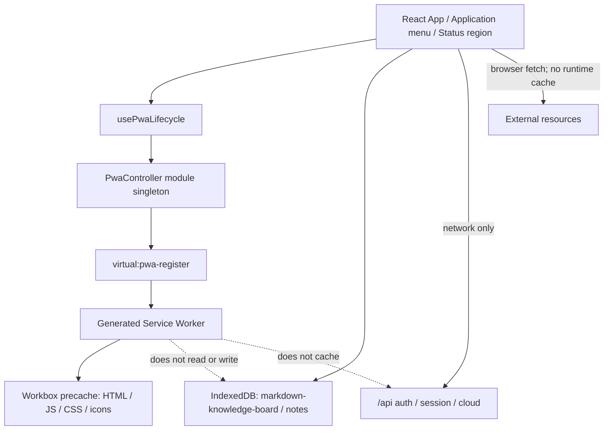

# Markdown Knowledge Board フェーズ3 PWA基本・詳細設計

作成日: 2026-08-06
更新日: 2026-10-06
文書状態: 実装反映版。両本番Originのmanifest／Service Worker配信をHTTP確認済み。実機確認は[チェックリスト](./phase3-pwa-device-checklist.md)を参照。
上位文書: [フェーズ3 PWA要件定義](./phase3-pwa-requirements.md)

---

## 1. 目的と設計方針

本書は、Markdown Knowledge Boardをインストール可能なPWAとし、初回オンライン準備後の完全オフライン起動、安全な明示更新、端末別インストール導線を実装するための構成と契約を定義する。

設計上の最優先事項は次のとおりである。

1. Service Workerのinstall／update／cleanupからIndexedDBを分離し、ノートと未保存draftを失わない。
2. `/api/**`、OAuth、session、GitHub／Gist、暗号化backupをキャッシュしない。
3. 新版を検出しても自動reloadせず、既存の`handleSave(): Promise<boolean>`が成功した場合だけ更新する。
4. PWA機能が失敗または非対応でも、オンラインWebとローカル編集を継続する。
5. Production 2 Originを独立したPWAとして扱い、Origin間のデータ共有を追加しない。

## 2. テスト設計観点

ケース実装より前に、次の観点と失敗時の切り分け方法を設計レビューする。

### 2.1 観点一覧

| 分類 | 設計で保証すること | 主な検証手段 |
| --- | --- | --- |
| 機能 | manifest、registration、precache、offline起動、install、update、再接続 | unit、build検査、production-build E2E |
| 非機能 | 起動性能、cache容量、更新信頼性、security、accessibility、互換性 | build budget、複数browser、障害注入、axe相当確認 |
| データ | IndexedDB正本、Cache Storage分離、Origin分離、update前後の不変性 | fake IndexedDB、cache監査、v1→v2 E2E |
| UI | Application menu、Offline、Update available、dirty確認、focus | component、keyboard、390×844 E2E |

### 2.2 系統別の切り分け

| 系統 | 設計上の焦点 | 検証意図 |
| --- | --- | --- |
| 正常系 | ready後offline起動、install、clean／dirty update | 主導線が最後まで完結すること |
| 異常系 | register失敗、precache 404、quota不足、save失敗、update失敗 | 旧版とlocal dataが残ること |
| 境界値 | ready前後、4 MB asset、5 MiB総量、0／多数notes、1／2 tabs | 境界でcache漏れや誤activateがないこと |
| 状態遷移 | install、connectivity、waiting、dialog、cloud busy、controllerchange | late eventと競合で状態を巻き戻さないこと |

### 2.3 実行順序・再現性

- Service Worker試験はVite dev serverではなくproduction buildを使う。
- 通常試験はbrowser context単位でregistration、Cache Storage、IndexedDBを初期化する。
- update試験だけは同一Originのv1状態を保持し、配信物をv2へ切り替えて実行する。
- `navigator.serviceWorker.ready`、waiting worker、cache entryを条件待機し、固定sleepだけに依存しない。
- update fixtureとProduction smokeはserialで実行する。同一実機スマートフォンへ並列実行しない。
- 失敗時はworker state、controller、cache version、build ID、network request、dirty／dialog／cloud busyを証跡化する。

## 3. 採用構成

### 3.1 技術選定

| 項目 | 採用 | 理由 |
| --- | --- | --- |
| Vite統合 | `vite-plugin-pwa@^1.3.0` | Vite 7をpeer dependencyとして扱い、manifestとWorkbox生成をbuildへ統合できる |
| Service Worker生成 | Workbox `generateSW` | custom fetch処理を持たず、precacheとnavigation fallbackだけで要件を満たせる |
| 更新方式 | `registerType: "prompt"` | waiting workerを利用者の明示操作までactivateしない |
| 登録方式 | `injectRegister: null`＋`virtual:pwa-register` | React側の状態、dirty保存、update UIと明示的に接続する |
| runtime cache | なし | API、外部resource、user dataの誤cacheを構造的に防ぐ |
| local data | 既存IndexedDBを継続 | install／updateでDB schemaや保存先を変えない |
| 状態共有 | module singleton＋`useSyncExternalStore` | React StrictModeでもregistrationを重複させず、UIから購読できる |

`autoUpdate`は採用しない。`skipWaiting`と`clientsClaim`はともに`false`とし、現在タブが明示的に更新を選んだ場合だけwaiting workerへactivate要求を送る。

### 3.2 非採用案

| 案 | 非採用理由 |
| --- | --- |
| `registerType: "autoUpdate"` | dirty draftやdialog操作中に新旧切替が起こり、要件の明示更新契約を満たさない |
| `injectManifest`によるcustom worker | Phase 3のfetch要件には過剰で、security reviewとworker固有test範囲が広がる |
| stale-while-revalidateのHTML | HTMLとhash assetのversion混在が起こりやすい |
| APIのNetworkFirst cache | offline時に古い認証・Gist結果を返す危険がある |
| user-authored外部resourceのruntime cache | CORS、opaque response、privacy、quotaの範囲が拡大する |
| Service Workerへのnote保存 | IndexedDB正本とcacheの責務を混在させる |

## 4. 現行build基準値

2026-08-06に`npm run build`で測定した基準値を、Phase 3のbuild budget判定に使う。

| 項目 | 基準値 |
| --- | ---: |
| build file数 | 68 |
| raw合計 | 8,160,762 bytes |
| gzip合計 | 2,537,728 bytes |
| 最大asset | `marp-*.js` 3,650,803 bytes |
| 最大asset gzip | 1,213,449 bytes |
| main `index-*.js` | 1,050,877 bytes |

- 要件のgzip合計5 MiB以内に対し、現行は約2.54 MBである。
- `marp-*.js`は2 MiBを超えるため、Workboxの単体precache上限を`4_000_000` bytesに明示する。
- Phase 3だけを理由に現行のMermaid／Marp code splittingを変更しない。4 MB／5 MiB gateを超えた場合に別途最適化する。
- Viteの500 kB chunk warningは現行baselineとして記録し、PWA cache漏れとは別に扱う。

## 5. 全体構成



責務境界は次のとおりとする。

- React Appは利用者操作、dirty保存、dialog／focus、表示copyを管理する。
- `PwaController`はbrowser eventとworker lifecycleを正規化し、serializable snapshotとして公開する。
- generated Service Workerはbuild assetのprecacheとnavigation fallbackだけを担当する。
- IndexedDBとPhase 2 cloud hookは既存責務を維持し、Service Workerを認識しない。

## 6. Build・manifest設計

### 6.1 Vite設定

`vite.config.ts`へ`VitePWA`を追加する。`loadEnv`でbuild時の有効条件を解決し、ProductionまたはPWA test build以外では生成自体を無効化する。

```ts
const pwaBuildEnabled =
  env.VITE_PWA_ENABLED === "true" ||
  env.VITE_PWA_TEST_ENABLED === "true";

VitePWA({
  disable: !pwaBuildEnabled,
  strategies: "generateSW",
  registerType: "prompt",
  injectRegister: null,
  includeAssets: [
    "favicon.svg",
    "icons/pwa-192.png",
    "icons/pwa-512.png",
    "icons/pwa-maskable-512.png",
    "icons/apple-touch-icon.png",
  ],
  manifest: {
    id: "/",
    name: "Markdown Knowledge Board",
    short_name: "Knowledge Board",
    description: "A local-first Markdown knowledge board.",
    lang: "en",
    start_url: "/",
    scope: "/",
    display: "standalone",
    theme_color: "#1d1d1d",
    background_color: "#f7f7f7",
    categories: ["productivity"],
    icons: [/* 192, 512, maskable 512 */],
  },
  workbox: {
    globPatterns: ["**/*.{html,js,css,svg,png,ico,webmanifest}"],
    navigateFallback: "/index.html",
    navigateFallbackDenylist: [/^\/api(?:\/|$)/],
    runtimeCaching: [],
    cleanupOutdatedCaches: true,
    skipWaiting: false,
    clientsClaim: false,
    maximumFileSizeToCacheInBytes: 4_000_000,
  },
  devOptions: {
    enabled: false,
  },
})
```

- `disable: true`のPreview／通常local buildではmanifestをinjectせず、Service Workerも生成・登録しない。
- `devOptions.enabled`は通常開発で`false`を維持し、stale workerがVite HMRへ干渉しないようにする。
- PWA E2Eは`vite build --mode pwa-test`と`vite preview`を使い、dev workerを有効化しない。
- `.env.pwa-test`には秘密情報を置かず、`VITE_PWA_TEST_ENABLED=true`だけを定義する。
- `src/vite-env.d.ts`へ`vite-plugin-pwa/client`の型参照を追加する。
- `index.html`のVite既定iconを削除し、favicon、Apple touch icon、theme colorをmanifestと一致させる。

### 6.2 アイコン

採用案は **A. Markdown Board** とする。承認済みのベクター原案は
`docs/assets/phase3-pwa-icon-a-master.svg` を正本とし、install用PNGとfaviconは
この正本から生成する。

| file | 用途 | 契約 |
| --- | --- | --- |
| `public/favicon.svg` | browser tab | A案と同じboard／M／down arrow。小サイズでも線を省略しない |
| `public/icons/pwa-192.png` | Chromium install | 192×192、sRGB、透過なし |
| `public/icons/pwa-512.png` | high resolution install | 512×512、sRGB、透過なし |
| `public/icons/pwa-maskable-512.png` | maskable | 512×512、背景を全面塗りし、主要図形を中央safe zone 80%以内 |
| `public/icons/apple-touch-icon.png` | iOS | 180×180、sRGB、透過なし |

visual contractは次のとおりとする。

- canvas全体を`#1d1d1d`で塗り、OSが適用する外形maskに委ねる。sample sheetの外側の角丸はpreview表現であり、生成PNGへ焼き込まない。
- 白い角丸board outlineの内側へ、白い`M`とinteraction accentの下向き矢印を配置する。
- accent colorは現行UI tokenと整合する`#75a7ff`とする。
- 主要図形は中央揃えとし、maskable safe zone 80%から出さない。背景だけをsafe zone外まで連続させる。
- 192px／180pxへ縮小しても、board outline、`M`、arrow shaft／arrow headを判別できる線幅を維持する。
- 通常、円形mask、角丸四角mask、iOS previewを並べ、見切れ、透明欠け、色ずれ、文字潰れがないことを確認する。

### 6.3 build検証

`scripts/verify-pwa-build.mjs`を追加し、次を失敗条件として検査する。

- manifest必須fieldまたは必須iconの欠落
- icon寸法／purposeの不一致
- `sw.js`またはWorkbox runtimeの欠落
- `dist`の必須build assetがprecache manifestに存在しない
- raw 4,000,000 bytesを超える単一precache対象
- precache対象のgzip合計が5 MiBを超える
- `/api/`、`auth/session`、`cloud-backups`をURLとしてprecacheしている
- navigation denylistが`/api`を除外していない

warningだけでassetが除外される状態を成功扱いにしない。検査結果にはfile数、raw／gzip合計、最大asset、precache件数を出力する。

## 7. 環境・登録境界

### 7.1 capability

`src/lib/pwaCapability.ts`へ純粋関数とbrowser adapterを分けて実装する。

```ts
type PwaCapability =
  | { status: "enabled"; mode: "production" | "test" }
  | { status: "disabled" }
  | { status: "unsupported" };
```

Production有効条件:

1. `VITE_PWA_ENABLED === "true"`
2. `https:`
3. Originが`https://mkb.bamboosato.com`または`https://markdown-knowledge-board.vercel.app`
4. `navigator.serviceWorker`が存在する

test有効条件:

1. `VITE_PWA_TEST_ENABLED === "true"`
2. hostnameが`127.0.0.1`または`localhost`
3. production buildを`vite preview`で配信している

- query parameterだけではService Workerを有効化しない。
- build時の`disable`とruntime capabilityの二重gateにする。Previewではmanifest／workerを生成せず、誤ってProduction buildを別Originへ配信した場合もruntime gateで登録しない。
- disabled時はregisterもunregisterも自動実行しない。誤設定で既存offline appを破壊しないためである。
- local test後のregistration／cache削除はtest fixtureまたは明示的な開発手順で行い、IndexedDBは別指定がない限り削除しない。

### 7.2 HTTP cache header

`vercel.json`に以下のcache headerを実装済み。公開情報ページのPWA navigationは`vite.config.ts`の`navigateFallbackDenylist`でアプリ画面への置換を防ぎ、precacheされたHTMLを表示する。

| path | Cache-Control | 理由 |
| --- | --- | --- |
| `/sw.js` | `no-cache, max-age=0, must-revalidate` | worker更新を毎回revalidate可能にする |
| `/manifest.webmanifest` | `no-cache, max-age=0, must-revalidate` | install metadata更新を反映する |
| `/index.html` | `no-cache, max-age=0, must-revalidate` | navigationで新版確認を行う |
| `/assets/*` | `public, max-age=31536000, immutable` | hash付きassetを長期cacheする |
| `/api/*` | 既存APIの`no-store`を維持 | browser HTTP cacheとSW cacheの双方を防ぐ |

`Service-Worker-Allowed: /`は`sw.js`をroot配信する構成では不要だが、header追加後もscope `/`をProduction smokeで確認する。

## 8. PWA lifecycle controller

### 8.1 file構成

```text
src/
  pwa/
    pwaController.ts
    pwaTypes.ts
  hooks/
    usePwaLifecycle.ts
  lib/
    pwaCapability.ts
    storagePersistence.ts
```

`pwaController.ts`はmodule singletonとし、`start()`を複数回呼んでも同じPromiseとregistrationを返す。React StrictMode、component再mount、menu再表示で重複登録しない。

### 8.2 snapshot

```ts
type PwaSnapshot = {
  registration:
    | "disabled"
    | "unsupported"
    | "registering"
    | "ready"
    | "error";
  connectivity: "online" | "offline";
  install:
    | "unavailable"
    | "available"
    | "prompting"
    | "dismissed"
    | "installed"
    | "ios-help";
  update:
    | "idle"
    | "checking"
    | "downloading"
    | "waiting"
    | "applying"
    | "error";
  updateDeferred: boolean;
  offlineReady: boolean;
  error?: { operation: "register" | "install" | "update"; message: string };
};
```

非serializableな`BeforeInstallPromptEvent`、`ServiceWorkerRegistration`、`updateSW` functionはcontrollerのprivate fieldに保持する。snapshotへtoken、note、URL query、user情報を入れない。

### 8.3 browser event

| event／callback | state変更 | 副作用 |
| --- | --- | --- |
| `beforeinstallprompt` | install=`available` | `preventDefault()`しeventをprivate保持 |
| `appinstalled` | install=`installed` | prompt参照を破棄、persistent storageをbest effort要求 |
| `online`／`offline` | connectivity更新 | cloud actionは開始しない |
| `onOfflineReady` | offlineReady=`true` | diagnostics更新のみ。modalを自動表示しない |
| `onNeedRefresh` | update=`waiting` | 非modal banner表示を許可 |
| `onRegisteredSW` | registration=`ready` | registration参照を保持 |
| `onRegisterError` | registration=`error` | sanitized warning。Appは継続 |

### 8.4 update check

- 初回登録時にbrowser既定のupdate checkを利用する。
- documentがvisibleへ戻ったとき、前回確認から60分以上経過していれば`registration.update()`を実行する。
- offline中は明示checkを行わない。onlineへ戻っただけでは即時check／reloadしない。
- `Later`はwaiting workerを維持したまま現在sessionのbannerを隠す。次回起動、別のwaiting worker、または60分後のvisible checkで再表示できる。
- check失敗は旧版を継続し、local UIをerror画面へ遷移させない。

## 9. Fetch・cache設計

### 9.1 precache対象

- `/index.html`
- Viteが出力した全JS／CSS chunk
- Mermaid／Marpのlazy chunk
- favicon、install icon、manifest
- locally bundled fontまたはworker assetを将来追加した場合は同じbuild検査へ含める

全chunkをprecacheする理由は、offline起動後に初めてPreview／Slides／Mermaidを開く場合もnetworkへ依存させないためである。

### 9.2 request分類

| request | strategy | offline時 |
| --- | --- | --- |
| scope内navigation | network確認＋precache app shell fallback | `/index.html`を返す |
| precache済みhash asset | precache cache | assetを返す |
| `/api/**` | browser network | 失敗を既存hookへ返す |
| same-origin非build asset | browser network | cacheしない |
| cross-origin image／font／iframe | browser network | 個別失敗。本文操作は継続 |

`runtimeCaching`を空にすることで、APIをNetworkOnly routeへ列挙し忘れてもWorkbox runtime cacheへ入らない。`navigateFallbackDenylist`はAPI URLをSPA HTMLへ誤変換しないために残す。

### 9.3 cache cleanupと複数tab

- waiting workerのinstallが完了するまではactive workerと現行precacheを維持する。
- 明示activate後にWorkboxがobsolete entryをcleanupする。
- `clientsClaim: false`とし、他tabを強制reloadしない。
- 更新を選んだtabだけ`updateSW(true)`で1回reloadする。
- 他tabのdirty draftはReact memoryと`beforeunload`保護を維持する。他tabには自動`location.reload()`を実装しない。
- controller change後のreload要求はmodule内single-flight flagで1回に制限する。

## 10. Install設計

### 10.1 Application menu

現行root menuは`Local Data`、Production時の`GitHub`で構成される。PWA actionはroot末尾へ直接追加し、第三階層は作らない。

```text
Local Data                         category
GitHub                             category / Production only
Install App                        action / prompt available + ready
Install Help                       action / iPhone Safari + not standalone
```

- `Install App`と`Install Help`は同時表示しない。
- install action refをroot menuのkeyboard navigation対象へ追加する。
- native prompt開始前にmenuを閉じる。prompt解決後はApplication menu triggerへfocusを戻す。
- install拒否はerror alertにせず、現在sessionではactionを隠す。再訪時にbrowserがeventを再発火すれば再表示できる。
- standalone判定は`matchMedia("(display-mode: standalone)")`を主とし、iOSの`navigator.standalone`をfallbackにする。
- eventがないだけで「インストール済み」と断定しない。

### 10.2 iPhone Install Help

`PwaInstallHelpDialog`は次を案内する。

1. Safariの共有メニューを開く。
2. `Add to Home Screen`を選ぶ。
3. `Open as Web App`を有効にする。
4. `Add`を選ぶ。

dialogはEscape、Close、focus trap、triggerへのfocus復帰を既存dialog契約に合わせる。Android／desktopでprompt eventがない場合は無効なHelpを推測表示しない。

## 11. Offline・Update UI設計

### 11.1 Status region

`.app`直下、`.app-workspace`の直前に`PwaStatusRegion`を置く。通常flow内に配置し、editorやmobile safe areaへoverlayしない。

```text
PwaStatusRegion
  OfflineStatus                connectivity=offline
  PwaUpdateNotice              update=waiting && !deferred && dialog非表示
```

- `Offline`は`role="status"`、`aria-live="polite"`とし、online／offline eventの重複を抑える。
- Update noticeは表示時にfocusを移動しない。
- 390×844では縦積みにし、横scrollを発生させない。
- OfflineとUpdateが同時の場合はOfflineを先に表示する。

### 11.2 update notice

表示copy:

```text
Update available
Restart to update
Later
```

- background operation中は主操作をdisabledにし、`Finish the current action before updating.`を説明として関連付ける。
- modal表示中はnoticeをmountせず、modal終了後に表示する。
- `Later`はnoticeを閉じるがwaiting workerを破棄しない。

### 11.3 dirty update

`Restart to update`押下時に次を判定する。

```ts
const hasUnsavedChanges = isDirtyRef.current || tagInput.trim().length > 0;
```

dirtyなら`PwaUpdateDialog`を表示する。

```text
Update available
Save your changes before restarting to update.
[Save and restart] [Cancel]
```

処理順:

```text
waiting + dirty
  -> Save and restart
  -> await handleSave()
  -> false: dialog維持、draft維持、worker waiting
  -> true: controller.applyUpdate()
  -> updateSW(true)
  -> current tab reload once
```

- discard actionを追加しない。
- `saveStatus === "saving"`は二重操作を拒否する。
- `PwaUpdateDialog`を既存keyboard shortcutの`isDialogOpen`判定へ追加する。
- save errorは既存`lastSaveError`とdialog内alertから確認できる。

### 11.4 operation blocker

次のいずれかをupdate blockerとする。

- `saveStatus === "saving"`
- `githubSession.busyAction !== null`
- `cloudBackup.uploading`
- `cloudRestore.downloading || cloudRestore.preparing || cloudRestore.applying`
- unsaved、cloud、backup、restore、filter、operation、delete、revert、metadata、install help、update dialogのいずれかがopen
- import／export処理中を表す既存または追加busy state

blocker解除をpollingせずReact stateから再計算する。late update eventはworkerをwaitingのまま維持する。

## 12. Persistent storage

`src/lib/storagePersistence.ts`にbest-effort helperを置く。

```ts
type PersistenceResult = "persisted" | "denied" | "unsupported" | "failed";
```

- `navigator.storage.persisted()`がtrueなら再要求しない。
- `persist()`は`appinstalled`後、または明示Save成功後にsession内1回だけ試す。
- 拒否／非対応／例外で保存を失敗扱いにしない。
- 結果をbackup成功として表示しない。
- IndexedDB、Cache Storage、localStorageを削除しない。
- READMEへアンインストール／site data消去時のlocal data保持はbrowser依存と追記する。

## 13. Error・diagnostics

### 13.1 error分類

| code | UI | 継続動作 |
| --- | --- | --- |
| `PWA_UNSUPPORTED` | 表示なし | 通常Web |
| `PWA_DISABLED` | 表示なし | 通常Web |
| `PWA_REGISTER_FAILED` | console warning。必要時のみ非blocking notice | online Web＋IndexedDB |
| `PWA_INSTALL_FAILED` | install actionを復帰または非blocking error | editor継続 |
| `PWA_UPDATE_CHECK_FAILED` | update errorを成功表示しない | active版継続 |
| `PWA_UPDATE_APPLY_FAILED` | `Update failed. Keep using the current version and try again.` | active版／draft継続 |
| `PWA_CACHE_BUDGET_EXCEEDED` | build失敗 | deploy禁止 |

### 13.2 diagnostics

Production consoleへ出す値はoperation、worker state、scope、sanitized error nameまでとする。次を出さない。

- note ID／title／body／metadata
- GitHub login／Gist ID
- query parameter
- CSRF token／passphrase／derived key／encrypted payload

自動E2Eではtest専用APIからではなくpage evaluateでregistrationとcache keyを収集する。Production UIへdebug panelは追加しない。

## 14. テスト詳細設計

### 14.1 unit

| 対象 | 正常 | 異常／境界 | 意図 |
| --- | --- | --- | --- |
| `pwaCapability` | 2 Production Origin、loopback test | Preview、http Production、未知Origin、API非対応 | registration境界を固定 |
| controller reducer | ready、available、waiting、installed | late callback、重複event、register error | 状態巻戻り防止 |
| install adapter | accepted | dismissed、prompt reject、eventなし | menu表示とevent消費を保証 |
| update adapter | waiting→apply | deferred、apply reject、重複click | reload single-flight |
| persistence | persisted／granted | denied、unsupported、throw | Saveから障害分離 |
| cache verifier | 全asset収載 | 4 MB超、5 MiB超、API文字列 | 不完全offline buildを防止 |

browser APIは完全なstubを用意し、`MediaQueryList`、ServiceWorkerRegistration、install eventのlistenerとcleanupを検証する。

### 14.2 component

- root menuのInstall App／Install Help表示条件とkeyboard navigation
- native promptのaccepted／dismissed後のfocus復帰
- Offline表示の`role=status`、重複announce抑制
- Update availableのexact copy、Later、busy disabled説明
- dirty時のSave and restart／Cancelだけのdialog
- Save成功時だけapply、Save失敗時のdraft／dialog維持
- dialog open中にupdate callbackが来てもfocusを奪わない

### 14.3 build検査

1. `npm run build:pwa:test`
2. `npm run verify:pwa`
3. manifest JSON、icon寸法、HTML linkを検査
4. `sw.js`のprecache entryと全build assetを突合
5. gzip総量と最大fileを出力
6. API、auth、cloud URLがcache対象にないことを検査

### 14.4 E2E

PWA専用configを`playwright.pwa.config.ts`へ分離し、通常configのVite dev serverと混在させない。

主要scenario:

1. clean contextでonline表示し、SW readyとprecache完了を待つ。
2. pageを閉じ、contextをofflineにして新規pageから起動する。
3. note CRUD、search、Preview、Mermaid、Slides、local import/exportを確認する。
4. offlineで`/api/auth/session`を呼んでもCache Storageから成功responseを返さない。
5. v1配信後に同一Originをv2へ切り替え、waiting noticeを確認する。
6. clean update、dirty save成功、dirty save失敗、Laterを分ける。
7. 2 tabsの一方でupdateし、他方のdirty draftと非強制reloadを確認する。
8. precache asset 404、quota相当、registration rejectを注入し、旧版／Web fallbackを確認する。

update E2Eは`tests/fixtures/pwa-version-server.mjs`で同じportの配信rootをv1／v2へ切り替える。Production codeへtest endpointを追加しない。suiteは`workers: 1`、`reuseExistingServer: false`とする。

### 14.5 cross-browserと実機

- Chromium: manifest、precache、offline、update、2 tabsの全scenario
- Firefox／WebKit: offline再起動、local core、API非cache、非対応install UI縮退
- Android Chrome／iPhone Safari: [要件定義の実機手順](./phase3-pwa-requirements.md#13-実機スマートフォン手動検証)をユーザーが手動実施
- 実装側は環境記録表、手順、期待結果、スクリーンショット欄を提供する

## 15. 変更予定file

| file | 変更内容 |
| --- | --- |
| `package.json`／lockfile | `vite-plugin-pwa`、PWA build／verify／E2E scripts |
| `vite.config.ts` | manifest、generateSW、precache、budget |
| `vercel.json` | worker／manifest／HTML／asset cache header |
| `index.html` | favicon、Apple touch icon、theme color |
| `public/icons/*` | install icon一式 |
| `src/pwa/pwaController.ts` | singleton、browser event、update／install action |
| `src/pwa/pwaTypes.ts` | state、event型 |
| `src/hooks/usePwaLifecycle.ts` | React購読adapter |
| `src/lib/pwaCapability.ts` | Production／test gate |
| `src/lib/storagePersistence.ts` | best-effort persistence |
| `src/components/PwaStatusRegion.tsx` | Offline／Update notice |
| `src/components/PwaUpdateDialog.tsx` | dirty update確認 |
| `src/components/PwaInstallHelpDialog.tsx` | iPhone手順 |
| `src/App.tsx` | menu、dirty save、blocker、status region統合 |
| `src/App.css` | status、dialog、390×844、safe area |
| `scripts/verify-pwa-build.mjs` | artifact／budget検査 |
| `playwright.pwa.config.ts` | production preview専用config |
| `tests/unit/pwa*.test.ts` | capability／state／adapter test |
| `tests/e2e/pwa*.spec.ts` | offline／install／update／cache E2E |
| `tests/fixtures/pwa-version-server.mjs` | v1／v2同一Origin fixture |
| `README.md`／`docs/design-spec.md` | 利用方法、制限、復旧、現行仕様 |

## 16. 要件トレーサビリティ

| 設計領域 | 主な要件ID |
| --- | --- |
| manifest／icon | PWA-MAN-001..007 |
| registration／environment | PWA-REG-001..005 |
| precache／fetch | PWA-CACHE-001..008、PWA-SEC-001..005 |
| offline local core | PWA-OFF-001..008 |
| install | PWA-INSTALL-001..007 |
| update／dirty／multi-tab | PWA-UPD-001..010 |
| storage | PWA-DATA-001..007 |
| performance／reliability | PWA-NFR-001..007 |
| accessibility／responsive | PWA-UI-001..005 |

## 17. 参照資料

- [フェーズ3 PWA要件定義](./phase3-pwa-requirements.md)
- [現行設計仕様](./design-spec.md)
- [vite-plugin-pwa Getting Started](https://vite-pwa-org.netlify.app/guide/)
- [Register Service Worker](https://vite-pwa-org.netlify.app/guide/register-service-worker)
- [Prompt for new content refreshing](https://vite-pwa-org.netlify.app/guide/prompt-for-update)
- [generateSW](https://vite-pwa-org.netlify.app/workbox/generate-sw)
- [Workbox precaching](https://developer.chrome.com/docs/workbox/modules/workbox-precaching)
- [Web Application Manifest](https://www.w3.org/TR/appmanifest/)
- [Service Workers](https://www.w3.org/TR/service-workers/)
